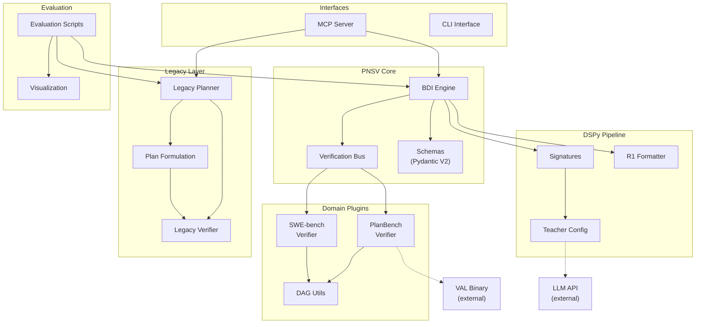

# C4 Component Index — PNSV Framework

## System Components

| Component | Description | Documentation |
|-----------|-------------|---------------|
| **BDI Engine** | Core orchestrator: goal → plan → verify loop | [c4-component-bdi-engine.md](c4-component-bdi-engine.md) |
| **Verification Bus** | 3-layer verification routing (Structural → Symbolic → Physics) | [c4-component-verification-bus.md](c4-component-verification-bus.md) |
| **Domain Plugins** | Strategy-pattern verifiers (PlanBench, SWE-bench) | [c4-component-domain-plugins.md](c4-component-domain-plugins.md) |
| **DSPy Pipeline** | LLM orchestration, signatures, teacher config, R1 formatter | [c4-component-dspy-pipeline.md](c4-component-dspy-pipeline.md) |
| **Legacy Planner** | Full-featured planner in src/bdi_llm/ with multi-provider support | [c4-component-legacy-planner.md](c4-component-legacy-planner.md) |
| **MCP Server** | Agent integration via Model Context Protocol | [c4-component-mcp-server.md](c4-component-mcp-server.md) |
| **Evaluation Pipeline** | Batch evaluation, result analysis, visualization | [c4-component-evaluation.md](c4-component-evaluation.md) |

## Component Relationships

## Dependency Flow

1. **MCP Server** / **Evaluation Scripts** → import **BDI Engine** or **Legacy Planner**
2. **BDI Engine** → creates plans via **DSPy Signatures** → routes through **Verification Bus**
3. **Verification Bus** → dispatches to **Domain Plugins** (PlanBench or SWE-bench)
4. **Domain Plugins** → use **DAG Utils** for graph operations, call **VAL** for symbolic checks
5. **R1 Formatter** → intercepts successful engine loops, serializes to training format
