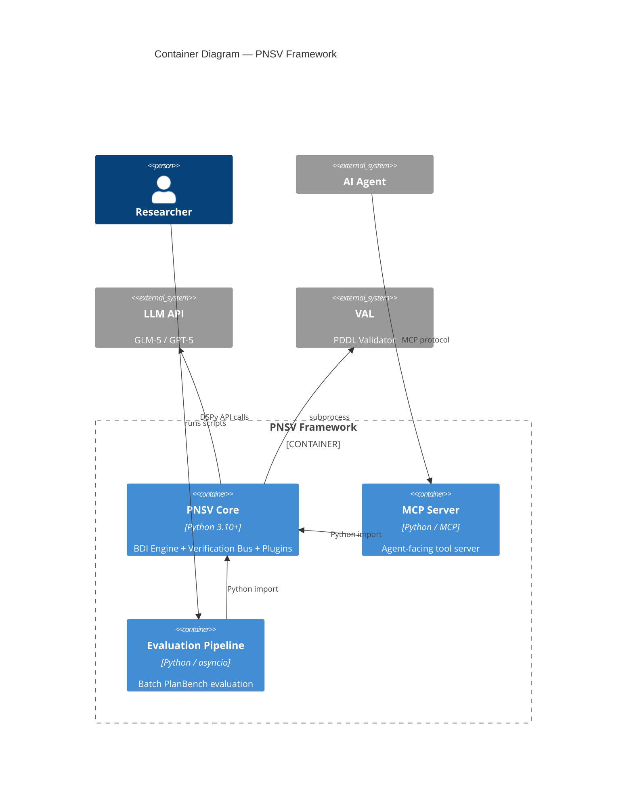

# C4 Container — BDI-LLM Formal Verification (PNSV)

## Containers

### 1. PNSV Core Application

| Property | Value |
|----------|-------|
| **Name** | PNSV Core Application |
| **Type** | CLI Application / Library |
| **Technology** | Python 3.10+, Pydantic V2, DSPy |
| **Deployment** | Local execution / Docker container |

**Purpose**: The main application containing the BDI reasoning engine, verification bus, domain plugins, DSPy pipeline, and plan repair logic. Executed via CLI scripts or imported as a library.

**Components**:
- [BDI Engine](c4-component-bdi-engine.md)
- [Verification Bus](c4-component-verification-bus.md)
- [Domain Plugins](c4-component-domain-plugins.md)
- [DSPy Pipeline](c4-component-dspy-pipeline.md)
- [Legacy Planner](c4-component-legacy-planner.md)

**Interfaces**:
- Python API: `bdi_engine.generate_plan()`, `bdi_engine.verify_plan()`
- CLI: `scripts/run_planbench_full.py`, `scripts/run_evaluation.py`

---

### 2. MCP Server

| Property | Value |
|----------|-------|
| **Name** | MCP Server |
| **Type** | Service (long-running) |
| **Technology** | Python, MCP Protocol |
| **Deployment** | Local process |

**Purpose**: Exposes PNSV capabilities as MCP tools for integration with AI agents (Claude Code, Cursor, etc.).

**Components**:
- [MCP Server Component](c4-component-mcp-server.md)

**Interfaces**:
| Interface | Protocol | Description |
|-----------|----------|-------------|
| `generate_verified_plan` | MCP | Accept goal + domain → return verified plan |

---

### 3. Evaluation Pipeline

| Property | Value |
|----------|-------|
| **Name** | Evaluation Pipeline |
| **Type** | Batch Processing Scripts |
| **Technology** | Python, asyncio, multiprocessing |
| **Deployment** | Local execution (nohup for long runs) |

**Purpose**: Runs full-dataset evaluations across PlanBench domains with parallel workers, checkpointing, and result analysis.

**Components**:
- [Evaluation Scripts](c4-component-evaluation.md)
- [Result Visualization](c4-component-visualization.md)

**Interfaces**:
| Interface | Protocol | Description |
|-----------|----------|-------------|
| CLI | Shell | `--domain`, `--workers`, `--execution_mode` flags |
| File I/O | JSON | Results to `runs/`, checkpoints for resume |

---

## Dependencies

```
PNSV Core ──→ LLM Provider (HTTP/REST via DSPy)
PNSV Core ──→ VAL Binary (subprocess)
MCP Server ──→ PNSV Core (Python import)
Evaluation ──→ PNSV Core (Python import)
Evaluation ──→ PlanBench Data (filesystem)
```

## Infrastructure

- **Dockerfile**: Single container with Python 3.10+, all dependencies
- **Scaling**: Parallel workers via `--workers N` flag (multiprocessing)
- **Storage**: JSON results in `runs/`, frozen snapshots in `artifacts/`

---

## Container Diagram


