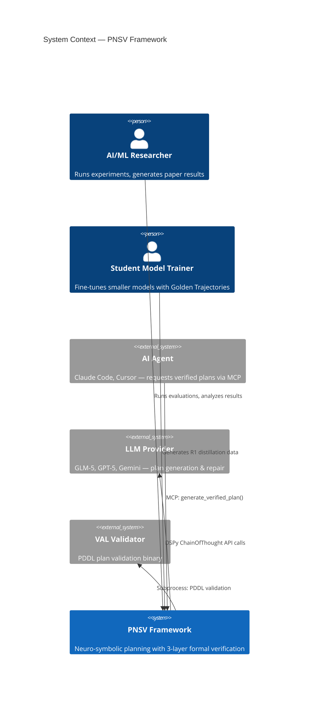

# C4 Context — BDI-LLM Formal Verification (PNSV)

## System Overview

### Short Description
A neuro-symbolic planning framework that combines LLM generation with formal verification to produce provably correct plans.

### Long Description
PNSV (Pluggable Neuro-Symbolic Verification) addresses the hallucination and logical inconsistency problems in LLM-generated plans. It receives natural language goals, generates structured BDI plans (Beliefs-Desires-Intentions) as Directed Acyclic Graphs (DAGs) using DSPy-orchestrated LLMs, then runs every generated plan through a 3-layer verification pipeline (Structural → Symbolic → Physics). Plans failing verification are automatically repaired and re-verified. Successful verification loops are serialized into R1-compatible thinking trajectories for student model fine-tuning.

---

## Personas

### 1. AI/ML Researcher (Human User)
- **Type**: Human User
- **Description**: Academic researcher studying neuro-symbolic reasoning, automated planning, or LLM reliability
- **Goals**: Run reproducible experiments on PlanBench domains; generate publishable results (AAAI 2026); analyze verification + repair effectiveness across domains; compare NAIVE / BDI_ONLY / FULL_VERIFIED / FULL_VERIFIED+REPAIR modes
- **Key Features**: PlanBench evaluation, ablation modes (incl. REPAIR), auto-repair loop, result visualization, paper figure generation

### 2. AI Agent (Programmatic User)
- **Type**: Programmatic User
- **Description**: AI coding agent (Claude Code, Cursor, etc.) that needs verified plans for task execution
- **Goals**: Request verified plans via MCP protocol; receive provably correct action sequences
- **Key Features**: MCP Server integration, `generate_verified_plan` tool

### 3. Student Model Trainer (Human User)
- **Type**: Human User
- **Description**: ML engineer fine-tuning smaller models using Golden Trajectories
- **Goals**: Generate verified `<think>` tag training data from successful BDI reasoning loops; distill into DeepSeek-R1 or similar student models
- **Key Features**: R1 Distillation formatter, teacher configuration

### 4. External LLM Provider (External System)
- **Type**: External System
- **Description**: GLM-5, GPT-5, Gemini, Qwen — teacher LLMs providing plan generation and repair capabilities
- **Integration**: DSPy ChainOfThought via OpenAI-compatible API

### 5. VAL Validator (External System)
- **Type**: External System
- **Description**: PDDL plan validator binary for symbolic verification
- **Integration**: Subprocess execution with structured output parsing

---

## System Features

| Feature | Description | Users |
|---------|-------------|-------|
| Verified Plan Generation | Generate BDI plans and verify through 3 layers | AI Agent, Researcher |
| PlanBench Evaluation | Full-dataset evaluation across Blocksworld, Logistics, Depots | Researcher |
| Ablation Testing | NAIVE / BDI_ONLY / FULL_VERIFIED comparison modes | Researcher |
| Auto-Repair | Iterative plan repair using verifier feedback | AI Agent, Researcher |
| R1 Distillation | Serialize successful loops into `<think>` training data | Student Model Trainer |
| MCP Server | Expose verified planning as agent tool | AI Agent |
| SWE-bench Domain | Software engineering task planning and verification | Researcher |

---

## User Journeys

### Journey 1: Researcher → PlanBench Evaluation
1. Configure `.env` with LLM provider credentials
2. Run `python scripts/run_planbench_full.py --domain blocksworld --all_domains`
3. System loads PDDL instances from `planbench_data/`
4. For each instance: generate plan → verify → record result
5. Results saved to `runs/` with checkpoint support
6. Run figure generation scripts to produce paper-ready visualizations
7. Analyze with `scripts/analyze_verification_results.py`

### Journey 2: AI Agent → MCP Verified Plan
1. Agent connects to `src/mcp_server_bdi.py`
2. Calls `generate_verified_plan(goal, domain, context, pddl_domain_file, pddl_problem_file)`
3. Server generates plan via DSPy planner
4. Plan passes through 3-layer verification
5. If invalid: returns verification error
6. Returns verified plan or error

### Journey 3: Trainer → R1 Distillation
1. Configure teacher LLM (GLM-5) via `teacher_config.py`
2. Run BDI reasoning loop on target domain
3. Successful verify-repair loops intercepted by `r1_formatter.py`
4. Converted to strict `<think>...</think><answer>...</answer>` format
5. Saved as Golden Trajectories for student model fine-tuning

---

## External Systems & Dependencies

| System | Type | Purpose | Integration |
|--------|------|---------|-------------|
| OpenAI-compatible LLM API | Service | Plan generation | HTTP/REST via DSPy |
| VAL Binary | Tool | PDDL symbolic verification | Subprocess (macOS arm64) |
| PlanBench Dataset | Data | PDDL problem instances | File system (planbench_data/) |
| SWE-bench Dataset | Data | Software engineering tasks | File system (swe_bench_data/) |
| MLflow | Service | Experiment tracking | SQLite (mlflow.db) |
| Docker | Platform | Containerized deployment | Dockerfile |

---

## System Context Diagram

---

## Related Documentation

- [Container Documentation](c4-container.md)
- [Component Index](c4-component.md)
