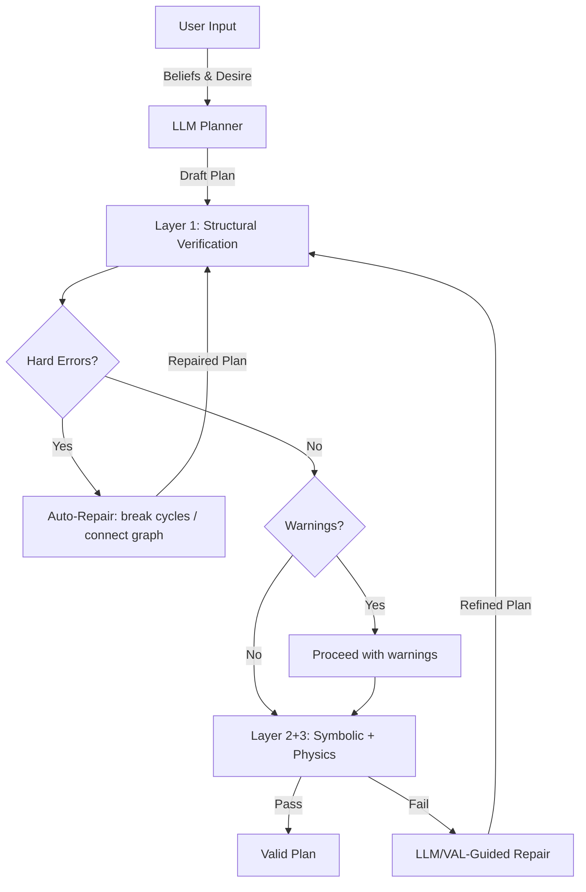

# System Architecture

The BDI-LLM Framework implements a **neuro-symbolic planning architecture** that integrates Large Language Models (LLMs) with formal verification methods.

## Core Philosophy

Traditional LLM planning suffers from two critical issues:
1.  **Hallucination**: Generating valid-looking but logically impossible actions (e.g., picking up an object that isn't clear).
2.  **Structural Inconsistency**: Generating cyclic dependencies (hard failure) or disconnected subgraphs (soft warning).

This framework addresses these by treating the LLM as a **Generative Compiler**—translating natural language goals into formal BDI (Belief-Desire-Intention) structures—and using rigorous **Formal Verifiers** to validate the output.

## Architecture Overview

```mermaid
graph TD
    User[User Input] -->|Beliefs & Desire| Planner[LLM Planner]
    Planner -->|Draft Plan| L1[Layer 1: Structural Verification]

    L1 --> Hard{Hard Errors?}
    Hard -->|Yes| RepairStruct[Auto-Repair: break cycles / connect graph]
    RepairStruct -->|Repaired Plan| L1

    Hard -->|No| Warn{Warnings?}
    Warn -->|Yes| Note[Proceed with warnings]
    Warn -->|No| L23[Layer 2+3: Symbolic + Physics]
    Note --> L23

    L23 -->|Pass| Execution[Valid Plan]
    L23 -->|Fail| RepairLLM[LLM/VAL-Guided Repair]
    RepairLLM -->|Refined Plan| L1
```

## Verification Layers

The system enforces validity through three distinct layers of verification:

### Layer 1: Structural Verification (Graph Theory)
Ensures the plan is structurally executable and reports graph quality.
*   **Hard checks**: Empty graph, Cycle detection.
*   **Soft checks**: Weak connectivity (reported as warnings, not blockers).
*   **Implementation**: `src/bdi_llm/verifier.py` using `networkx`.
*   **Role**: Prevents deadlocks while surfacing disconnected subplans for downstream validation/repair.

### Layer 2: Symbolic Verification (PDDL)
Checks logical consistency against Planning Domain Definition Language (PDDL) rules.
*   **Checks**: Action preconditions (e.g., `(clear A)` before `(pickup A)`), Effect application.
*   **Tools**: Integrates with [VAL (Plan Validation Tool)](https://github.com/KCL-Planning/VAL).
*   **Role**: Guarantees that the plan is logically sound within the defined domain.

### Layer 3: Physics Validation (Domain-Specific)
Validates constraints that are difficult to express in pure PDDL or require simulation.
*   **checks**: Domain-specific physics rules (e.g., Blocksworld stability).
*   **Implementation**: `src/bdi_llm/symbolic_verifier.py` (e.g., `BlocksworldPhysicsValidator`).
*   **Role**: Ensures executability in the target environment.

## Key Components

### 1. BDI Planner (`src/bdi_llm/planner.py`)
Uses **DSPy** to prompt the LLM with a structured signature. It maps:
*   **Beliefs**: Current state of the world.
*   **Desire**: The goal state.
*   **Intention**: The generated plan (graph of actions).

### 2. Auto-Repair System (`src/bdi_llm/plan_repair.py`)
A heuristic-based module that automatically fixes common structural errors without re-querying the LLM.
*   **Capabilities**: Breaks cycles, connects disconnected subgraphs, unifies multiple root nodes, canonicalizes node IDs.

### 3. Integrated Verifier
Orchestrates the three verification layers and provides detailed error feedback.

### 4. MCP Server & Trojan Horse Pattern
The system is exposed via the Model Context Protocol (MCP) to allow agents to safely execute plans.

*   **Pattern**: "Trojan Horse" / Gated Execution.
*   **Mechanism**: The `execute_verified_plan` tool acts as a secure gatekeeper. It accepts a PDDL plan and a shell command. The command is *only* executed if the PDDL plan passes full verification.
*   **Goal**: Prevents agents from executing dangerous or hallucinatory commands by enforcing formal correctness first.

## Data Flow

1.  **Input**: Natural language goal + Initial state.
2.  **Generation**: LLM output structured JSON (BDIPlan schema).
3.  **Graph Construction**: JSON converted to NetworkX DiGraph.
4.  **Verification**:
    *   If **Hard Structure Fail** (empty/cycle): Trigger Auto-Repair.
    *   If **Structure Pass with warnings** (e.g., disconnected): Continue to Symbolic/Physics, and optionally run repair workflow.
5.  **Output**: Verified Plan or Error Report.
