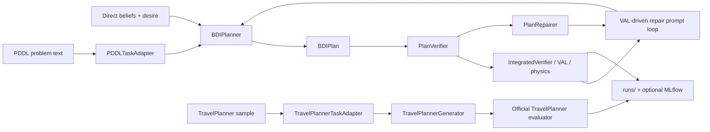
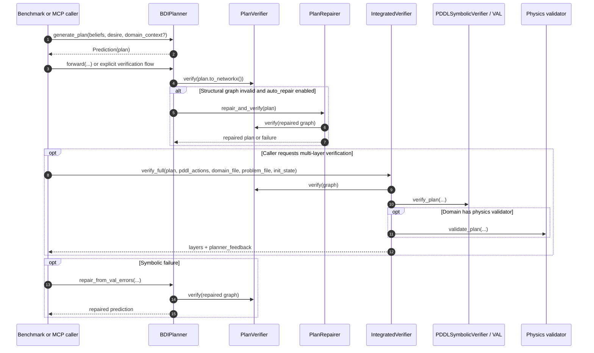
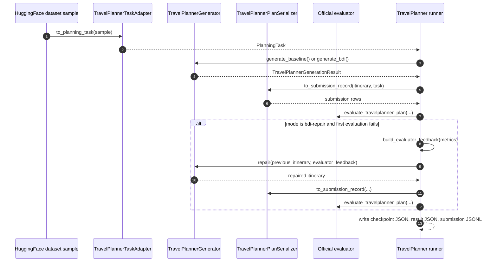

# Functional Flow

This page explains how the repository works today for an engineer who needs to run it, debug it, or extend it.

Document status:
- Generated on `2026-03-08`
- Validated against repository head commit `00b99f7`
- Written against the current runtime imports, not the older or experimental architecture docs

Reference policy:
- This page intentionally uses `file + symbol` references instead of hard-coded line numbers.
- The goal is to reduce drift as the code moves while still keeping every claim traceable to the current source tree.

The active runtime path is the `src/bdi_llm` package plus `src/interfaces` and the benchmark runners under `scripts/`. The `workspaces/pnsv_workspace` tree remains useful as an architecture reference, but it is not the default runtime path imported by the current MCP server, CLI demo, PlanBench runner, TravelPlanner runner, or dynamic-replanning runner.

## 1. Runtime Scope and Directory Roles

The repository has three practical layers: active runtime code, benchmark workspaces, and retained architecture work.

| Area | Role in the current runtime | Primary source anchors |
| --- | --- | --- |
| `src/bdi_llm/` | Active planner, schemas, verification, repair, TravelPlanner, dynamic replanning, batch inference | `planner/bdi_engine.py -> BDIPlanner`, `verifier.py -> PlanVerifier`, `symbolic_verifier.py -> IntegratedVerifier` |
| `src/interfaces/` | User-facing entrypoints for the CLI demo and MCP server | `cli.py -> main`, `mcp_server.py -> generate_plan`, `mcp_server.py -> verify_plan`, `mcp_server.py -> execute_verified_plan` |
| `scripts/evaluation/` | Main evaluation and benchmark entrypoints | `run_planbench_full.py`, `run_generic_pddl_eval.py`, `run_verification_only.py`, `run_travelplanner_eval.py` |
| `scripts/replanning/` | Execution-aware repair loop for dynamic replanning | `run_dynamic_replanning.py -> generate_and_replan`, `run_dynamic_replanning.py -> run_dynamic_replanning_eval` |
| `workspaces/planbench_data/` | PDDL datasets, PlanBench assets, and the local `VAL` validator binary | `config.py -> Config.VAL_VALIDATOR_PATH`, `symbolic_verifier.py -> PDDLSymbolicVerifier` |
| `workspaces/TravelPlanner_official/` | External checkout used by the TravelPlanner evaluator path | `travelplanner/official.py -> resolve_travelplanner_home`, `travelplanner/official.py -> evaluate_travelplanner_plan` |
| `runs/` | Checkpoints, results, and benchmark artifacts | `run_planbench_full.py -> checkpoint_path`, `travelplanner/runner.py -> _checkpoint_file`, `run_dynamic_replanning.py -> output_dir` |
| `mlruns/` and `mlflow.db` | Optional experiment tracking store for PlanBench benchmarking | `run_planbench_full.py -> mlflow.set_experiment`, `run_planbench_full.py -> mlflow.log_artifact` |
| `workspaces/pnsv_workspace/` | Retained domain-agnostic architecture workspace, useful for design study but not the default runtime | `core/bdi_engine.py -> BDIEngine`, `core/verification_bus.py -> BaseDomainVerifier` |

The main planning data structure in the active runtime is `BDIPlan`. It contains `ActionNode` and `DependencyEdge`, converts into a `networkx` graph via `to_networkx()`, and can parse raw LLM output through `BDIPlan.from_llm_text()`.

Source anchors:
- `src/bdi_llm/schemas.py -> ActionNode`
- `src/bdi_llm/schemas.py -> DependencyEdge`
- `src/bdi_llm/schemas.py -> BDIPlan`
- `src/bdi_llm/schemas.py -> BDIPlan.to_networkx`
- `src/bdi_llm/schemas.py -> BDIPlan.from_llm_text`

## 2. Runtime Preconditions and Configuration

The runtime contract is defined by `Config` and `configure_dspy()`, not by older session notes.

Source anchors:
- `src/bdi_llm/config.py -> Config`
- `src/bdi_llm/config.py -> Config.get_credentials`
- `src/bdi_llm/config.py -> Config.validate`
- `src/bdi_llm/planner/dspy_config.py -> configure_dspy`
- `.env.example`

### Required credential model

The current code reads these credential families:
- `OPENAI_API_KEY`
- `ANTHROPIC_API_KEY`
- `GOOGLE_API_KEY`
- `GOOGLE_APPLICATION_CREDENTIALS`

The active runtime does **not** read `DASHSCOPE_API_KEY` from `Config`.

If you are using DashScope or another OpenAI-compatible gateway, the current runtime expects you to:
1. Put the provider token into `OPENAI_API_KEY`
2. Set the compatible endpoint in `OPENAI_API_BASE`
3. Choose the actual model through `LLM_MODEL`

This matters because older session notes mention `DASHSCOPE_API_KEY`, but the active code path is built around `OPENAI_API_KEY` plus `OPENAI_API_BASE`.

### Core environment variables

| Variable | Purpose in the current runtime | Source anchor |
| --- | --- | --- |
| `OPENAI_API_KEY` | Default key for OpenAI-compatible providers and many reasoning-model paths | `config.py -> Config.OPENAI_API_KEY`, `planner/dspy_config.py -> configure_dspy` |
| `OPENAI_API_BASE` | Base URL for OpenAI-compatible gateways, NVIDIA endpoints, or custom proxies | `config.py -> Config.OPENAI_API_BASE`, `planner/dspy_config.py -> configure_dspy` |
| `ANTHROPIC_API_KEY` | Anthropic-backed DSPy path | `config.py -> Config.ANTHROPIC_API_KEY` |
| `GOOGLE_API_KEY` | Direct Gemini path | `config.py -> Config.GOOGLE_API_KEY`, `planner/dspy_config.py -> configure_dspy` |
| `GOOGLE_APPLICATION_CREDENTIALS` | Vertex AI path | `config.py -> Config.GOOGLE_APPLICATION_CREDENTIALS`, `planner/dspy_config.py -> configure_dspy` |
| `LLM_MODEL` | Runtime model selector used by planner, TravelPlanner, and replanner flows | `config.py -> Config.MODEL_NAME`, `planner/dspy_config.py -> configure_dspy`, `dynamic_replanner/replanner.py -> DynamicReplanner.__init__` |
| `VAL_VALIDATOR_PATH` | Overrides the local `VAL` binary path | `config.py -> Config.VAL_VALIDATOR_PATH`, `symbolic_verifier.py -> PDDLSymbolicVerifier.__init__` |
| `SAVE_REASONING_TRACE` | Enables persisted reasoning traces in outputs | `config.py -> Config.SAVE_REASONING_TRACE` |
| `REASONING_TRACE_MAX_CHARS` | Caps saved reasoning length | `config.py -> Config.REASONING_TRACE_MAX_CHARS` |
| `API_BUDGET_MAX_CALLS_PER_INSTANCE`, `API_BUDGET_MAX_RPM`, `API_BUDGET_MAX_RPH` | Repair-loop throttling and budget controls | `config.py -> API budget fields`, `api_budget.py -> BudgetConfig` |

### Provider selection behavior

`configure_dspy()` chooses a backend based on `LLM_MODEL` plus available credentials:
- Gemini models use Google credentials
- Vertex models use service-account environment configuration
- OpenAI-compatible and reasoning-model paths use `OPENAI_API_KEY` and optionally `OPENAI_API_BASE`
- NVIDIA-compatible flows are treated as OpenAI-compatible with a different base URL pattern

Source anchors:
- `src/bdi_llm/planner/dspy_config.py -> configure_dspy`
- `src/bdi_llm/planner/dspy_config.py -> ResponsesAPILM`

### `VAL` requirement

Any symbolic PDDL verification path requires a valid `VAL` binary. The default path is derived from the repo root and points into `workspaces/planbench_data/planner_tools/VAL/validate`.

Source anchors:
- `src/bdi_llm/config.py -> Config.VAL_VALIDATOR_PATH`
- `src/bdi_llm/symbolic_verifier.py -> PDDLSymbolicVerifier.__init__`

### `.env` caveat

`Config._resolve_key()` explicitly skips values that still look like `${VAR}` placeholders. That means `python-dotenv` will not rescue shell-style interpolation for you. Put real values in `.env`, or export them in the shell before running the process.

Source anchors:
- `src/bdi_llm/config.py -> _resolve_key`
- `.env.example`

## 3. Core Verified Planning Flow

The mainline verified-planning path is built around `BDIPlanner`.

Primary source anchors:
- `src/bdi_llm/planner/bdi_engine.py -> BDIPlanner.__init__`
- `src/bdi_llm/planner/bdi_engine.py -> BDIPlanner.generate_plan`
- `src/bdi_llm/planner/bdi_engine.py -> BDIPlanner.forward`
- `src/bdi_llm/planner/bdi_engine.py -> BDIPlanner.repair_from_val_errors`

### Step 1: normalize the task

For benchmarked PDDL tasks, the input is normalized through `PlanningTask` plus `PDDLTaskAdapter`. The adapter extracts `:objects`, `:init`, and `:goal` from PDDL and turns them into planner-facing `beliefs` and `desire`. For TravelPlanner, `TravelPlannerTaskAdapter` instead builds `beliefs` from the query and reference information and injects the TravelPlanner output specification as `domain_context`.

Source anchors:
- `src/bdi_llm/planning_task.py -> PlanningTask`
- `src/bdi_llm/planning_task.py -> PDDLTaskAdapter`
- `src/bdi_llm/travelplanner/adapter.py -> TravelPlannerTaskAdapter`

### Step 2: generate a plan

`BDIPlanner.generate_plan()` is the public generation entrypoint. It chooses the proper DSPy signature from the resolved `DomainSpec`, optionally requires `domain_context` for generic PDDL mode, and returns a `dspy.Prediction` containing a `BDIPlan`.

Source anchors:
- `src/bdi_llm/planner/bdi_engine.py -> BDIPlanner.generate_plan`
- `src/bdi_llm/planner/domain_spec.py -> DomainSpec`

### Step 3: run structural validation

`BDIPlanner.forward()` turns the plan into a graph and sends it to `PlanVerifier.verify()`. Structural validation is deliberately narrow:
- empty graph = hard error
- cycle = hard error
- disconnected components = warning

The result is a `VerificationResult` that still supports tuple-like compatibility for older callers.

Source anchors:
- `src/bdi_llm/planner/bdi_engine.py -> BDIPlanner.forward`
- `src/bdi_llm/verifier.py -> VerificationResult`
- `src/bdi_llm/verifier.py -> PlanVerifier.verify`

### Step 4: optionally apply structural repair

If structural validation fails and `auto_repair` is enabled, `repair_and_verify()` uses `PlanRepairer` to:
- break cycles
- connect disconnected subgraphs with virtual nodes
- unify multiple roots
- unify multiple terminals
- re-run structural verification

This stage fixes graph shape only. It does not prove symbolic executability.

Source anchors:
- `src/bdi_llm/plan_repair.py -> PlanRepairer.repair`
- `src/bdi_llm/plan_repair.py -> PlanRepairer._break_cycles`
- `src/bdi_llm/plan_repair.py -> PlanRepairer._connect_subgraphs`

### Step 5: run symbolic and physics validation

`IntegratedVerifier` is the multi-layer validator for the active runtime. It owns:
- `PDDLSymbolicVerifier` for `VAL`
- optional domain physics validators such as `BlocksworldPhysicsValidator`
- `build_planner_feedback()` to compress failures into repair-friendly feedback

Structural hard errors block symbolic checking. If structural validation passes, symbolic and optional physics validation produce a layered result object that higher-level callers can inspect or convert into repair prompts.

Source anchors:
- `src/bdi_llm/symbolic_verifier.py -> PDDLSymbolicVerifier`
- `src/bdi_llm/symbolic_verifier.py -> BlocksworldPhysicsValidator`
- `src/bdi_llm/symbolic_verifier.py -> IntegratedVerifier`
- `src/bdi_llm/symbolic_verifier.py -> IntegratedVerifier.verify_full`
- `src/bdi_llm/symbolic_verifier.py -> IntegratedVerifier.build_planner_feedback`

### Step 6: run the VAL-driven repair loop when needed

If symbolic validation fails in a benchmark path, `BDIPlanner.repair_from_val_errors()` becomes the active recovery mechanism. It:
- carries forward prior failed attempts
- builds structured verifier feedback
- consults `APIBudgetManager` for rate limits, per-instance budgets, and early exit rules
- consults `RepairCache` to avoid repeating identical repair requests
- calls the DSPy repair signature
- re-validates the repaired graph structurally

Source anchors:
- `src/bdi_llm/planner/bdi_engine.py -> BDIPlanner.repair_from_val_errors`
- `src/bdi_llm/api_budget.py -> APIBudgetManager`
- `src/bdi_llm/repair_cache.py -> RepairCache`

### Step 7: persist artifacts

Persistence is owned by the calling runner, not by `BDIPlanner`. PlanBench writes checkpoints and final results under `runs/`, and optionally logs metrics plus the result artifact to MLflow.

Source anchors:
- `scripts/evaluation/run_planbench_full.py -> checkpoint_path`
- `scripts/evaluation/run_planbench_full.py -> save_checkpoint_atomic`
- `scripts/evaluation/run_planbench_full.py -> run_evaluation`

## 4. Runtime Modes

### PlanBench and generic PDDL

`scripts/evaluation/run_planbench_full.py` is the main benchmark entrypoint for the active runtime. It defines three execution stages:
- `baseline`
- `bdi`
- `bdi-repair`

At a high level:
- `baseline` generates direct grounded action sequences
- `bdi` runs the graph-based planner and verification path
- `bdi-repair` enables structural auto-repair and VAL-driven repair attempts

The runner owns:
- checkpoint auto-resume
- per-instance result aggregation
- optional parallel execution
- optional MLflow logging

Source anchors:
- `scripts/evaluation/run_planbench_full.py -> EXECUTION_STAGES`
- `scripts/evaluation/run_planbench_full.py -> execution_mode_flags`
- `scripts/evaluation/run_planbench_full.py -> checkpoint_path`

### MCP server

The MCP server is a thin integration layer over the active planner and symbolic verifier. It exposes:
- `generate_plan`
- `verify_plan`
- `execute_verified_plan`

`execute_verified_plan` is the formally gated execution path: it only executes the shell command after the supplied PDDL plan passes validation.

Source anchors:
- `src/interfaces/mcp_server.py -> generate_plan`
- `src/interfaces/mcp_server.py -> verify_plan`
- `src/interfaces/mcp_server.py -> execute_verified_plan`

### TravelPlanner

TravelPlanner is the current non-PDDL benchmark path. It does **not** produce `BDIPlan`. It produces `TravelPlannerItinerary` objects and proves quality through the official evaluator.

The runtime flow is:
1. Convert the official sample into `PlanningTask`
2. Generate a baseline or BDI itinerary
3. Serialize into official submission rows
4. Evaluate with the official commonsense and hard-constraint evaluators
5. If mode is `bdi-repair`, build evaluator feedback and re-run repair once before the second evaluation pass
6. Persist checkpoint JSON, result JSON, and JSONL submission files under `output_dir/<split>/<mode>/`

Source anchors:
- `src/bdi_llm/travelplanner/adapter.py -> TravelPlannerTaskAdapter`
- `src/bdi_llm/travelplanner/engine.py -> TravelPlannerGenerator`
- `src/bdi_llm/travelplanner/runner.py -> evaluate_sample`
- `src/bdi_llm/travelplanner/runner.py -> run_split`
- `src/bdi_llm/travelplanner/official.py -> evaluate_travelplanner_plan`

### Dynamic replanning

Dynamic replanning is execution-aware rather than purely static. The flow is:
1. Generate an initial plan with `BDIPlanner`
2. Convert it into grounded PDDL actions
3. Execute each prefix with `PlanExecutor`
4. When an action fails, capture the exact executed prefix and the exact failure reason
5. Ask `DynamicReplanner` for a recovery plan
6. Append the recovery suffix to the successful prefix and retry
7. Stop on success or after `max_replans`

Source anchors:
- `scripts/replanning/run_dynamic_replanning.py -> generate_and_replan`
- `src/bdi_llm/dynamic_replanner/executor.py -> PlanExecutor.execute`
- `src/bdi_llm/dynamic_replanner/replanner.py -> DynamicReplanner.generate_recovery_plan`

### SWE-bench / coding planning

The coding path is more experimental, but it still rides on the active mainline. `CodingBDIPlanner` subclasses `BDIPlanner`, swaps in a coding-specific DSPy signature, and constrains action types to `read-file`, `edit-file`, `run-test`, and `create-file`. The local SWE-bench harness uses that planner and still relies on `PlanVerifier` for structural graph validity.

Source anchors:
- `src/bdi_llm/coding_planner.py -> CodingBDIPlanner`
- `scripts/swe_bench/swe_bench_harness.py -> LocalSWEBenchHarness`

## 5. Module Responsibilities

| Module | Key symbols | Responsibility |
| --- | --- | --- |
| `src/bdi_llm/planner/bdi_engine.py` | `BDIPlanner`, `generate_plan`, `forward`, `repair_from_val_errors` | Core LLM planning and repair orchestration |
| `src/bdi_llm/schemas.py` | `ActionNode`, `DependencyEdge`, `BDIPlan`, `from_llm_text` | Shared planner contract and parsing |
| `src/bdi_llm/verifier.py` | `VerificationResult`, `PlanVerifier.verify` | Structural graph gate |
| `src/bdi_llm/symbolic_verifier.py` | `PDDLSymbolicVerifier`, `BlocksworldPhysicsValidator`, `IntegratedVerifier` | Symbolic and domain-specific validation |
| `src/bdi_llm/plan_repair.py` | `PlanRepairer`, `repair_and_verify` | Structural graph repair |
| `src/bdi_llm/planning_task.py` | `PlanningTask`, `TaskAdapter`, `PlanSerializer`, `PDDLTaskAdapter` | Benchmark-to-planner normalization |
| `src/bdi_llm/travelplanner/` | `TravelPlannerTaskAdapter`, `TravelPlannerGenerator`, `evaluate_sample`, `run_split` | Non-PDDL benchmark integration |
| `src/bdi_llm/dynamic_replanner/` | `PlanExecutor`, `ExecutionResult`, `DynamicReplanner` | Execution-aware recovery |
| `src/bdi_llm/api_budget.py` | `APIBudgetManager`, `BudgetConfig` | Rate limiting, budget checks, early exit |
| `src/bdi_llm/repair_cache.py` | `RepairCache`, `get_repair_cache` | Reuse of successful repair responses |
| `src/bdi_llm/batch_engine.py` | `BatchEngine`, `build_initial_plan_messages`, `build_replan_messages` | OpenAI-compatible batch inference path |
| `src/interfaces/mcp_server.py` | `generate_plan`, `verify_plan`, `execute_verified_plan` | Agent-facing tool interface |

## 6. Failure Modes and Troubleshooting

This section covers the common failure paths that matter during handoff and operations.

### 6.1 Missing or wrong credentials

Symptoms:
- planner initialization works, but live generation fails
- benchmark scripts print instructions to export provider credentials
- OpenAI-compatible requests fail even though `DASHSCOPE_API_KEY` is present in the shell

What to check:
- `Config.get_credentials()`
- `.env.example`
- `configure_dspy()`

Important current-runtime rule:
- The active code reads `OPENAI_API_KEY`, not `DASHSCOPE_API_KEY`
- If you are using DashScope or another compatible provider, map its token into `OPENAI_API_KEY` and set `OPENAI_API_BASE`

Source anchors:
- `src/bdi_llm/config.py -> Config.get_credentials`
- `src/bdi_llm/config.py -> Config.validate`
- `src/bdi_llm/planner/dspy_config.py -> configure_dspy`

### 6.2 `.env` interpolation does not work

Symptoms:
- credentials look present in `.env` but resolve as empty at runtime
- repair or dynamic replanning fails immediately after startup

Why:
- `_resolve_key()` ignores values that still look like `${VAR}`

What to do:
- put a concrete value in `.env`
- or export the variable in the shell before starting the process

Source anchors:
- `src/bdi_llm/config.py -> _resolve_key`

### 6.3 `VAL` missing, broken, or not executable

Symptoms:
- `PDDLSymbolicVerifier` raises `FileNotFoundError`
- symbolic verification is impossible even though structural verification passes

What to check:
- `Config.VAL_VALIDATOR_PATH`
- whether the expected binary exists in `workspaces/planbench_data/planner_tools/VAL/validate`
- file permissions on macOS and Linux

Source anchors:
- `src/bdi_llm/config.py -> Config.VAL_VALIDATOR_PATH`
- `src/bdi_llm/symbolic_verifier.py -> PDDLSymbolicVerifier.__init__`

### 6.4 Structural graph failures

Symptoms:
- `PlanVerifier` reports empty graph, cycle, or disconnected components
- planner output parses, but execution order is missing or unstable

What to inspect:
- the plan stored in the prediction
- `PlanVerifier.verify()`
- `PlanRepairer.repair()`

What to expect:
- empty graph and cycles are hard failures
- disconnected components are warnings, but the repair path may still choose to reconnect them

Source anchors:
- `src/bdi_llm/verifier.py -> PlanVerifier.verify`
- `src/bdi_llm/plan_repair.py -> PlanRepairer.repair`

### 6.5 Symbolic failure after structural success

Symptoms:
- graph looks valid but `VAL` reports missing preconditions or unmet goals
- PlanBench succeeds at `bdi` on some domains and needs repair on others

What to inspect:
- multi-layer verifier output
- `planner_feedback`
- the `val_repair` fields inside PlanBench result JSON

Source anchors:
- `src/bdi_llm/symbolic_verifier.py -> IntegratedVerifier.verify_full`
- `src/bdi_llm/symbolic_verifier.py -> IntegratedVerifier.build_planner_feedback`
- `scripts/evaluation/run_planbench_full.py -> execution_mode_flags`

### 6.6 Budget exhaustion or repeated-repair early exit

Symptoms:
- repair loop stops early with budget or repeated-pattern errors
- a failure that looks fixable never reaches many repair attempts

Why:
- `APIBudgetManager` enforces per-instance call limits, rate limits, and early exit
- `RepairCache` prevents repeated work for identical repair contexts

What to inspect:
- API budget environment variables
- the error signature path in `repair_from_val_errors()`

Source anchors:
- `src/bdi_llm/api_budget.py -> APIBudgetManager`
- `src/bdi_llm/repair_cache.py -> RepairCache`
- `src/bdi_llm/planner/bdi_engine.py -> BDIPlanner.repair_from_val_errors`

### 6.7 TravelPlanner setup failures

Symptoms:
- the TravelPlanner runner fails before evaluation starts
- the evaluator imports fail or required CSV files are missing

What to check:
- `TRAVELPLANNER_HOME` or the default checkout path
- `evaluation/eval.py` existence
- required database files under `database/`

Source anchors:
- `src/bdi_llm/travelplanner/official.py -> resolve_travelplanner_home`
- `src/bdi_llm/travelplanner/official.py -> check_travelplanner_database`
- `src/bdi_llm/travelplanner/official.py -> load_official_evaluator`

### 6.8 Dynamic replanning fails to recover

Symptoms:
- `PlanExecutor` finds the first failure correctly, but `DynamicReplanner` returns `None`
- replanning rounds complete with no final success

What to inspect:
- the exact `ExecutionResult` payload
- the recovery prompt construction
- provider configuration used by `DynamicReplanner`

Source anchors:
- `src/bdi_llm/dynamic_replanner/executor.py -> ExecutionResult`
- `src/bdi_llm/dynamic_replanner/executor.py -> PlanExecutor.execute`
- `src/bdi_llm/dynamic_replanner/replanner.py -> DynamicReplanner.generate_recovery_plan`

## 7. Appendix: What `workspaces/pnsv_workspace` Is

`workspaces/pnsv_workspace` is a retained architecture workspace that defines:
- a cleaner domain-agnostic `BDIEngine`
- a strict `BaseDomainVerifier` abstraction
- a strategy-oriented plugin model

In that design:
- the engine depends on an injected verifier and teacher
- domain logic lives behind the verifier interface
- the architecture boundary between engine, verifier plugins, and DSPy pipeline is cleaner than in the current mainline

Source anchors:
- `workspaces/pnsv_workspace/src/core/bdi_engine.py -> BDIEngine`
- `workspaces/pnsv_workspace/src/core/verification_bus.py -> BaseDomainVerifier`

This workspace is useful for architecture study and future refactoring, but it should not be mistaken for the repository's default operational path. The active benchmark runner imports `BDIPlanner`, `PlanVerifier`, and repair utilities from `bdi_llm`, and the active MCP server imports `BDIPlanner` plus `IntegratedVerifier` from the same mainline package.

Operational truth today:
- `scripts/evaluation/run_planbench_full.py`
- `src/interfaces/mcp_server.py`
- `src/bdi_llm/planner/bdi_engine.py`

If you are inheriting the codebase and need to fix a real runtime issue, start with the active mainline first and read `workspaces/pnsv_workspace` second.
