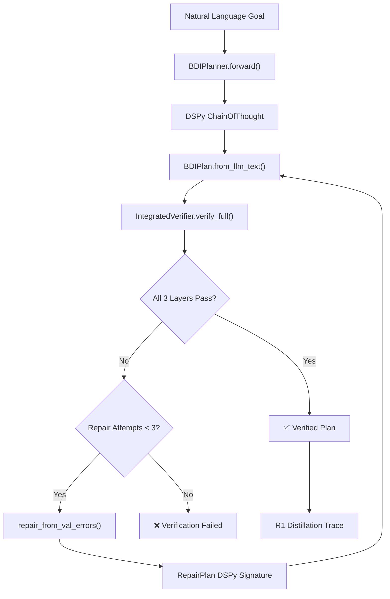
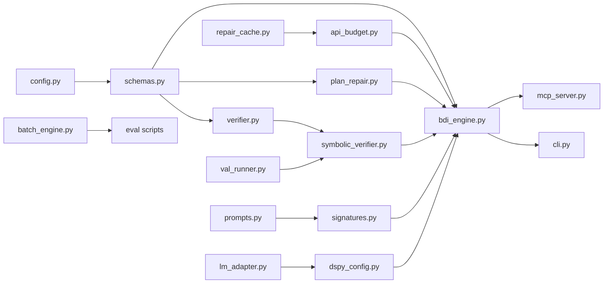

# PNSV Technical Reference

> Generated by docs-architect skill · Last updated: 2026-03-06  
> Framework version: Phase 3 (Modular Refactoring)

---

## 1. Executive Summary

**PNSV (Pluggable Neuro-Symbolic Verification)** is a domain-agnostic formal verification framework that bridges Large Language Models (LLMs) and classical AI planning. It implements the full BDI (Belief-Desire-Intention) agent loop — plan → verify → repair → re-verify — to produce provably correct action plans from natural language goals.

### Key Value Propositions

| Feature | Benefit |
|---------|---------|
| **3-Layer Verification** | Catches structural, symbolic, and domain-physics errors before execution |
| **Auto-Repair Loop** | Self-corrects invalid plans using verifier feedback (up to 3 iterations) |
| **Domain Agnosticity** | Strategy pattern allows plugging new domain verifiers without core changes |
| **Batch Inference** | DashScope Batch API support for large-scale evaluations |
| **MCP Integration** | Exposes verifier as a "Trojan Horse" planning gatekeeper for AI agents |
| **R1 Distillation** | Captures successful verification trajectories for model fine-tuning |

### Quantitative Impact

Across PlanBench (Blocksworld, Logistics, Depots), the framework demonstrates significant correctness improvement:
- **BASELINE** → raw LLM output (no verification)
- **BDI** → structured BDI generation before the repair loop
- **BDI_REPAIR** → 3-layer verification plus auto-repair recovers a large share of verifier-detected failures

---

## 2. Architecture Overview

### System Boundaries

PNSV operates as a Python library + CLI + MCP server that orchestrates:
1. **LLM Providers** (DashScope, OpenAI, Anthropic, Google) for plan generation
2. **VAL Binary** (C++ subprocess) for PDDL symbolic verification
3. **Local Datasets** (PlanBench PDDL files, SWE-bench instances) for evaluation

### Core Architecture Pattern: Compiler Pipeline

The system follows a compiler-like architecture:

```
Source (NL Goal) → Parser (schemas.py) → Type-Checker (verifier.py + symbolic_verifier.py)
                → Optimizer (plan_repair.py) → Code-Gen (batch_engine.py)
```

### The PNSV Verification Loop



### Module Dependency Graph



---

## 3. Design Decisions

### DD-1: DSPy over LangChain/Manual Prompting
**Choice**: DSPy as the LLM orchestration framework.  
**Rationale**: DSPy Signatures provide a declarative prompting contract, and ChainOfThought automatically injects CoT reasoning. The Signature abstraction cleanly separates domain-specific prompting logic from the core engine.

### DD-2: Strategy Pattern for Domain Verification
**Choice**: `PHYSICS_VALIDATORS` registry with `register_physics_validator()`.  
**Rationale**: Each planning domain has unique physical constraints. The Strategy pattern allows adding new domains (Logistics, Depots, generic PDDL) without modifying the IntegratedVerifier core. Currently registered: `BlocksworldPhysicsValidator`.

### DD-3: VAL as External Binary
**Choice**: Invoke VAL via subprocess rather than reimplementing PDDL validation.  
**Rationale**: VAL is the gold-standard PDDL validator used in IPC competitions. Wrapping it via subprocess ensures correctness parity with the planning community. The Dockerfile handles C++ compilation.

### DD-4: Pydantic V2 for Plan Schemas
**Choice**: Pydantic BaseModel with `model_validator` for schema normalization.  
**Rationale**: LLMs produce inconsistent JSON (varying field names, missing IDs). Pydantic validators automatically normalize `action→action_type`, `from_id→source`, etc. without brittle regex.

### DD-5: Separation of Hard Errors vs Soft Warnings
**Choice**: `VerificationResult` separates hard_errors from warnings.  
**Rationale**: Disconnected DAG components may represent valid parallel subplans. Only hard errors (cycles, empty graph) block further verification; warnings pass through to Layer 2 for final determination.

### DD-6: Cumulative Repair History
**Choice**: `repair_from_val_errors()` maintains a repair_history list across iterations.  
**Rationale**: Without history, the LLM may repeat the same fix. Cumulative history shows all previous failed attempts, enabling the LLM to try genuinely different strategies.

### DD-7: Few-Shot via YAML Files
**Choice**: Domain-specific demonstration examples stored as YAML in `src/bdi_llm/data/`.  
**Rationale**: YAML is more readable than embedded Python strings for multi-line plan examples. Each domain has its own demo file, loaded by `BDIPlanner._load_generation_demos()`.

---

## 4. Core Components

### 4.1 BDIPlanner (`src/bdi_llm/planner/bdi_engine.py`)

The central orchestrator implementing the BDI agent loop.

**Initialization** (L30-114):
- Selects domain-specific DSPy Signature based on `domain` parameter
- Domain mapping: `blocksworld→GeneratePlan`, `logistics→GeneratePlanLogistics`, `depots→GeneratePlanDepots`, others→`GeneratePlanGeneric`
- Optionally loads few-shot demos from YAML files
- Creates `dspy.ChainOfThought(Signature)` predictor
- Creates `RepairPlan` signature for auto-repair
- Sets auto_repair flag for structural repair

**Plan Generation** (`forward()`, L357-419):
- Calls `generate_plan()` which invokes ChainOfThought
- Parses prediction via `BDIPlan.from_llm_text()`
- Validates domain-specific action constraints via `_validate_action_constraints()`
- Optionally applies structural auto-repair via `PlanRepairer.repair()`
- Captures reasoning trace via `_capture_prediction_trace()`

**Iterative Repair** (`repair_from_val_errors()`, L528-664):
- Takes VAL errors and structured verification_feedback
- Checks RepairCache for cached results
- Computes error_signature for pattern detection
- Calls RepairPlan Signature with cumulative repair_history
- Returns new prediction or None (on cache hit or early exit)
- Error signature hashing detects repeated failure patterns

### 4.2 DSPy Signatures (`src/bdi_llm/planner/signatures.py`)

Five Signature classes define the LLM prompting contracts:

| Signature | Domain | Lines | Special Features |
|-----------|--------|-------|------------------|
| `GeneratePlan` | Blocksworld | L16-220 | LogiCoT + CoS protocol, 4 action types |
| `GeneratePlanLogistics` | Logistics | L223-405 | 6 action types with location constraints |
| `GeneratePlanDepots` | Depots | L458-705 | Complex multi-entity domain |
| `GeneratePlanGeneric` | Any PDDL | L408-455 | Accepts raw domain PDDL as context |
| `RepairPlan` | All | L708-778 | repair_history + verification_feedback fields |

### 4.3 Verification Pipeline

#### Layer 1: Structural (`src/bdi_llm/verifier.py`)

`PlanVerifier.verify(graph)` performs:
1. **Empty graph check** (HARD): No plan generated
2. **Connectivity check** (SOFT): Disconnected components flagged as warning
3. **Cycle detection** (HARD): Via `nx.is_directed_acyclic_graph()` + `nx.find_cycle()`

Returns `VerificationResult` with tuple-unpacking support for backward compatibility.

#### Layer 2: Symbolic (`src/bdi_llm/symbolic_verifier.py` + `val_runner.py`)

`PDDLSymbolicVerifier.verify_plan()`:
1. Writes plan actions to temp PDDL plan file
2. Invokes VAL binary via subprocess
3. Parses output for success/failure
4. Extracts actionable error messages including VAL Plan Repair Advice

#### Layer 3: Physics (`BlocksworldPhysicsValidator` in `symbolic_verifier.py`)

Simulates plan execution step-by-step:
- Tracks `on_table`, `on`, `clear`, `holding` state variables
- Validates preconditions for each action type:
  - `pick-up`: block is clear, on table, hand empty
  - `put-down`: hand holds the block
  - `stack(a,b)`: holding a, b is clear
  - `unstack(a,b)`: a on b, a is clear, hand empty

#### IntegratedVerifier (`symbolic_verifier.py`)

Orchestrates all 3 layers sequentially:
1. Structural → if hard errors, abort
2. Symbolic (VAL) → if available
3. Physics → if domain validator registered

`build_planner_feedback()` structures errors for the repair prompt.

### 4.4 Auto-Repair System

#### Structural Repair (`plan_repair.py`)

`PlanRepairer.repair()` applies:
1. `_connect_subgraphs()`: Virtual START/END nodes for disconnected components
2. `_break_cycles()`: DFS-based back-edge removal
3. `_unify_roots()` / `_unify_terminals()`: Single entry/exit points
4. `PlanCanonicalizer.canonicalize()`: Consistent node IDs + topological edge order

#### LLM-Guided Repair (`bdi_engine.py`)

`repair_from_val_errors()` iterates:
1. Check RepairCache → return cached if found
2. Format repair_history (previous failed attempts)
3. Format verification_feedback (structured Layer 1/2/3 diagnostics)
4. Call RepairPlan Signature → LLM generates corrected plan
5. Parse result → new BDIPlan
6. Cache result in RepairCache

### 4.5 Dynamic Replanning (`src/bdi_llm/dynamic_replanner/`)

Runtime replanning when execution fails mid-plan:

| Component | File | Responsibility |
|-----------|------|----------------|
| `DynamicReplanner` | `replanner.py` | LLM-based recovery plan generation |
| `BeliefBase` | `belief_base.py` | PDDL world state tracking |
| `Executor` | `executor.py` | Plan execution simulation |
| `SymbolicFallback` | `symbolic_fallback.py` | Graceful degradation when VAL unavailable |

Flow: Execute plan → action fails → BeliefBase updates → DynamicReplanner generates recovery plan → verify → execute.

---

## 5. Data Models

### Core Schemas

```
BDIPlan
├── goal_description: str
├── nodes: list[ActionNode]
│   ├── id: str (e.g., "s1", "s2")
│   ├── action_type: str (e.g., "pick-up", "stack")
│   ├── params: dict (e.g., {"block": "a"})
│   └── description: str
└── edges: list[DependencyEdge]
    ├── source: str
    ├── target: str
    └── relationship: str = "depends_on"
```

### Verification Results

```
VerificationResult (Layer 1 - Structural)
├── is_valid: bool
├── hard_errors: list[str]
└── warnings: list[str]

verify_full() result (IntegratedVerifier)
├── structural: {is_valid, errors}
├── symbolic: {is_valid, val_output, errors}
├── physics: {is_valid, errors}
└── overall_valid: bool
```

### Data Flow

```
NL Goal → DSPy Prediction → raw text → BDIPlan.from_llm_text()
       → BDIPlan → .to_networkx() → nx.DiGraph
       → PlanVerifier.verify() → VerificationResult
       → BDIPlan + PDDL actions → IntegratedVerifier.verify_full()
       → result dict → build_planner_feedback() → repair prompt
```

---

## 6. Integration Points

### MCP Server API

3 tools exposed via FastMCP:

| Tool | Input | Output | Pattern |
|------|-------|--------|---------|
| `generate_plan` | beliefs, desire | BDIPlan JSON | Direct generation |
| `verify_plan` | plan_json, domain_file, problem_file | Verification result | 3-layer check |
| `execute_verified_plan` | plan_json | Execution result | "Trojan Horse" — gated by verification |

### Python API

```python
from bdi_llm.planner.bdi_engine import BDIPlanner
from bdi_llm.symbolic_verifier import IntegratedVerifier
from bdi_llm.plan_repair import PlanRepairer

planner = BDIPlanner(domain="blocksworld", few_shot=True)
pred = planner.forward(beliefs="...", desire="...")
plan = BDIPlan.from_llm_text(pred.plan)

verifier = IntegratedVerifier(domain="blocksworld")
result = verifier.verify_full(plan, pddl_actions, domain_file, problem_file, init_state)
```

### Batch API

```python
from bdi_llm.batch_engine import BatchEngine, build_initial_plan_messages

engine = BatchEngine(model="qwq-plus")
messages = build_initial_plan_messages(beliefs, desire)
requests = [(instance_id, messages) for ...]
batch_id = engine.submit(requests)
results = engine.wait_and_download(batch_id)
```

### LLM Provider Support

| Provider | Config Key | Protocol | Status |
|----------|-----------|----------|--------|
| DashScope | `DASHSCOPE_API_KEY` | OpenAI-compatible HTTPS | Primary |
| OpenAI | `OPENAI_API_KEY` | HTTPS | Supported |
| Anthropic | `ANTHROPIC_API_KEY` | HTTPS | Supported |
| Google | `GOOGLE_API_KEY` | HTTPS | Supported |
| Vertex AI | `GOOGLE_APPLICATION_CREDENTIALS` | gRPC | Supported |

---

## 7. Deployment Architecture

### Local Development

```bash
git clone https://github.com/alexj11324/BDI_LLM_Formal_Ver.git
cd BDI_LLM_Formal_Ver
pip install -e .
cp .env.example .env
# Configure API keys
chmod +x workspaces/planbench_data/planner_tools/VAL/validate
```

### Docker Deployment

```bash
docker build -t bdi-verifier .
docker run -i --rm -e OPENAI_API_KEY=$OPENAI_API_KEY bdi-verifier
```

The Dockerfile:
- Uses Python 3.11 base image
- Compiles VAL from C++ source (solves cross-platform issues)
- Installs all Python dependencies
- Launches MCP server by default

### MCP Client Configuration

```json
{
  "mcpServers": {
    "bdi-pnsv-verifier": {
      "command": "docker",
      "args": ["run", "-i", "--rm", "-e", "OPENAI_API_KEY=YOUR_KEY", "bdi-verifier"]
    }
  }
}
```

---

## 8. Performance Characteristics

### Bottlenecks

| Component | Latency | Notes |
|-----------|---------|-------|
| LLM Plan Generation | 5-30s | Dominated by LLM inference time (model-dependent) |
| VAL Verification | <100ms | Fast C++ subprocess |
| Physics Simulation | <10ms | Pure Python state tracking |
| Structural Verification | <1ms | NetworkX graph analysis |
| Auto-Repair Iteration | 5-30s | Each repair = 1 LLM call |

### Optimization Strategies

- **RepairCache**: Avoids redundant LLM calls for same (domain, error, plan) tuple
- **Error Signature Hashing**: Early exit when repair enters a loop
- **APIBudgetManager**: Rate limiting prevents API quota exhaustion
- **Batch Inference**: Amortizes overhead for large-scale evaluations
- **DashScope Session Cache**: Reuses context for replanning calls
- **Per-Instance Budget Cap**: 5 calls max per problem instance (configurable)

### Concurrency Model

- Single-threaded by default (DSPy is not thread-safe)
- `APIBudgetManager` uses threading locks for shared state safety
- Evaluation scripts support `--parallel` for multi-instance evaluation
- Global singleton pattern for budget manager and repair cache

---

## 9. Security Model

### API Key Management

- All keys loaded from environment variables or `.env` file
- `_resolve_key()` skips unexpanded `${VAR}` references
- Multiple provider support with automatic fallback chain
- `.env` file excluded from git via `.gitignore`

### Subprocess Safety

- VAL invoked via `subprocess` with explicit path validation
- No shell=True (prevents injection)
- Temp files for PDDL plans cleaned up after verification

### Data Handling

- No persistent storage of API keys or user data
- Plans and verification results are transient (in-memory)
- Evaluation results written to local CSV files only
- Reasoning traces opt-in via `SAVE_REASONING_TRACE=true`

---

## 10. Appendices

### A. Glossary

| Term | Definition |
|------|-----------|
| **BDI** | Belief-Desire-Intention — agent architecture pattern |
| **PNSV** | Pluggable Neuro-Symbolic Verification — this framework |
| **IntentionDAG** | Directed Acyclic Graph representing a plan |
| **PDDL** | Planning Domain Definition Language |
| **VAL** | Validation tool for PDDL plans |
| **DSPy** | Declarative Self-improving Python — LLM framework |
| **LogiCoT** | Logic Chain-of-Thought — structured reasoning protocol |
| **CoS** | Chain-of-State — state tracking protocol |
| **PlanBench** | Planning benchmark (Blocksworld, Logistics, Depots) |
| **SWE-bench** | Software Engineering benchmark |
| **R1 Distillation** | Extracting reasoning traces for model fine-tuning |
| **RepairCache** | LRU cache for plan repair results |
| **Trojan Horse** | MCP pattern: execution gated by verification |

### B. Configuration Reference

| Variable | Default | Description |
|----------|---------|-------------|
| `DASHSCOPE_API_KEY` | — | Primary LLM provider API key |
| `OPENAI_API_KEY` | (fallback to DASHSCOPE) | OpenAI-compatible API key |
| `LLM_MODEL` | `openai/gpt-4o` | Model identifier |
| `LLM_MAX_TOKENS` | `4000` | Max generation tokens |
| `LLM_TEMPERATURE` | `0.2` | Generation temperature |
| `REASONING_EFFORT` | `medium` | Reasoning depth control |
| `LLM_TIMEOUT` | `600` | API call timeout (seconds) |
| `SAVE_REASONING_TRACE` | `false` | Enable trace capture |
| `REASONING_TRACE_MAX_CHARS` | `8000` | Max trace length |
| `VAL_VALIDATOR_PATH` | (auto-detected) | Path to VAL binary |
| `API_BUDGET_MAX_CALLS_PER_INSTANCE` | `5` | Max API calls per instance |
| `API_BUDGET_MAX_RPM` | `60` | Requests per minute limit |
| `API_BUDGET_MAX_RPH` | `1000` | Requests per hour limit |

### C. Directory Structure

```text
BDI_LLM_Formal_Ver/
├── src/
│   ├── bdi_llm/                    # Core framework
│   │   ├── planner/                # BDI engine + DSPy signatures
│   │   │   ├── bdi_engine.py       # Central orchestrator (718 lines)
│   │   │   ├── signatures.py       # 5 DSPy Signatures (779 lines)
│   │   │   ├── naive_planner.py    # Unverified baseline
│   │   │   ├── prompts.py          # LogiCoT/CoS constants
│   │   │   ├── dspy_config.py      # Multi-provider LM config
│   │   │   └── lm_adapter.py       # Custom DashScope adapter
│   │   ├── dynamic_replanner/      # Runtime replanning
│   │   │   ├── replanner.py        # LLM recovery plans
│   │   │   ├── belief_base.py      # PDDL state tracking
│   │   │   ├── executor.py         # Plan execution simulation
│   │   │   └── symbolic_fallback.py# Graceful degradation
│   │   ├── data/                   # Few-shot demos
│   │   │   ├── blocksworld_demos.yaml
│   │   │   ├── logistics_demos.yaml
│   │   │   ├── depots_demos.yaml
│   │   │   └── repair_demos.yaml
│   │   ├── schemas.py              # BDIPlan, ActionNode, DependencyEdge
│   │   ├── verifier.py             # Layer 1: Structural
│   │   ├── symbolic_verifier.py    # Layer 2+3: Symbolic + Physics
│   │   ├── val_runner.py           # VAL subprocess wrapper
│   │   ├── plan_repair.py          # Structural repair + canonicalization
│   │   ├── repair_cache.py         # LRU repair cache
│   │   ├── api_budget.py           # Rate limiting + budget
│   │   ├── config.py               # Central configuration
│   │   ├── batch_engine.py         # DashScope Batch API
│   │   ├── visualizer.py           # DAG rendering
│   │   └── coding_planner.py       # SWE-bench planner
│   └── interfaces/
│       ├── mcp_server.py           # FastMCP server (3 tools)
│       └── cli.py                  # CLI demo
├── scripts/
│   ├── evaluation/                 # PlanBench evaluation
│   ├── batch/                      # Batch inference
│   ├── replanning/                 # Dynamic replanning
│   ├── paper/                      # Paper figures
│   └── swe_bench/                  # SWE-bench harness
├── tests/                          # pytest test suite
├── docs/                           # Documentation
│   ├── c4/                         # C4 architecture docs
│   ├── conductor/                  # Project configuration
│   ├── wiki-catalogue.md           # Wiki structure
│   └── TECHNICAL_REFERENCE.md      # This document
├── workspaces/                     # PDDL data + tools
└── configs/                        # Runtime configs
```

### D. References

- Rao, A. S., & Georgeff, M. P. (1995). BDI agents: From theory to practice.
- DSPy: Declarative Self-improving Language Programs — Stanford NLP
- VAL: Plan Validation Tool — University of Strathclyde
- PlanBench: An Extensible Benchmark for Evaluating LLMs on Planning
- SWE-bench: Can Language Models Resolve Real-World GitHub Issues?
