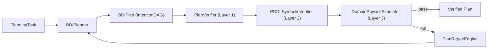

# Technical Reference — BDI-LLM Formal Verification (PNSV)

> Comprehensive technical manual for the PNSV framework.
> Version: March 2026 | Audience: Developers, Architects, Researchers

---

## 1. Executive Summary

PNSV (Pluggable Neuro-Symbolic Verification) is a neuro-symbolic planning framework that wraps LLM-based plan generation in a formal verification loop following the BDI (Belief-Desire-Intention) cognitive architecture. Given a natural-language goal and optional domain specification, the system:

1. **Generates** structured intention DAGs via DSPy Chain-of-Thought prompting
2. **Verifies** plans through 3 composable layers (structural → symbolic → domain physics)
3. **Auto-repairs** failed plans by feeding verification errors back into the generator (up to 3 iterations)
4. **Exposes** the loop as an MCP server for AI agent integration

**Key Results**:
- PlanBench: 100% accuracy across 5 PDDL domains with BDI+Repair
- TravelPlanner: 70.6% final pass rate (validation), 64.7% (official test leaderboard) — up from 21.1% baseline

---

## 2. Architecture Overview

### System Boundaries

PNSV operates as a stateless plan-verify-repair pipeline. It receives a `PlanningTask` (normalized input), generates a `BDIPlan` (intention DAG), verifies it, and either returns the verified plan or invokes the repair engine.

### Core Components



### Data Flow

1. **Input normalization**: Domain-specific adapters (`PDDLTaskAdapter`, `TravelPlannerTaskAdapter`) convert raw benchmark data into `PlanningTask`
2. **Plan generation**: `BDIPlanner` decomposes the goal into sub-goals, generates actions, and constructs an `IntentionDAG`
3. **Verification cascade**: Plans pass through structural → symbolic → domain-specific checks
4. **Repair loop**: Failed plans receive structured error feedback and are regenerated (max 3 iterations)
5. **Output**: Verified `BDIPlan` with full reasoning trace

### Key Directories

| Directory | Purpose |
|-----------|---------|
| `src/bdi_llm/planner/` | Core BDI engine, DSPy signatures, domain specs |
| `src/bdi_llm/travelplanner/` | TravelPlanner domain adapter and evaluator |
| `src/bdi_llm/dynamic_replanner/` | Runtime replan-on-failure loop |
| `src/bdi_llm/swe_bench/` | SWE-bench code repair integration |
| `src/interfaces/` | MCP server and CLI entry points |
| `scripts/evaluation/` | Benchmark evaluation scripts |
| `tests/` | Unit, integration, and smoke tests |

---

## 3. Design Decisions

### Why BDI over Raw LLM Prompting?

Raw LLM prompting produces flat action sequences that frequently hallucinate invalid steps. The BDI scaffold forces hierarchical decomposition (Beliefs → Desires → Intentions) and provides natural attachment points for formal verification.

### Why DSPy over LangChain?

DSPy provides **optimizable, version-controlled signatures** rather than string templates. This enables systematic prompt optimization via DSPy `BootstrapFewShot` and `MIPROv2`, and keeps prompts type-safe via Pydantic.

### Why VAL over Z3 for PDDL Verification?

VAL is the classical planning community's standard validator. Using it ensures compatibility with existing PDDL benchmarks and makes results directly comparable with planning literature. Z3 is available but used primarily for domain-specific physics constraints.

### Why MCP over REST API?

Model Context Protocol (MCP) enables direct integration with AI agents (Claude Code, Cursor) without building and maintaining a web server. The stdio transport is lightweight and requires no authentication infrastructure.

### Why Pluggable Domain Specs?

Different domains (blocksworld, logistics, TravelPlanner, SWE-bench) have fundamentally different action schemas, verification criteria, and few-shot examples. `DomainSpec` encapsulates these differences so a single `BDIPlanner` class works across all domains.

---

## 4. Core Components

### 4.1 BDI Engine (`src/bdi_llm/planner/bdi_engine.py`)

The central orchestrator. Takes a `PlanningTask`, decomposes the goal through DSPy signatures, and builds an `IntentionDAG` with `ActionNode`s carrying PDDL-compatible preconditions and effects.

**Key methods**:
- `BDIPlanner.__init__(domain_spec: DomainSpec)` — configure domain-specific behavior
- `BDIPlanner.generate(task: PlanningTask) -> BDIPlan` — full generation pipeline
- `BDIPlanner._decompose_goal()` — hierarchical goal decomposition
- `BDIPlanner._generate_actions()` — concrete action generation per sub-goal

### 4.2 Domain Spec (`src/bdi_llm/planner/domain_spec.py`)

Pluggable configuration container that defines:
- Action types and required parameters per domain
- DSPy Signature selection and few-shot demos
- Optional PDDL domain/problem context
- Domain-specific validation rules

**Built-in specs**: blocksworld, logistics, depots, TravelPlanner, SWE-bench. Custom domains via `DomainSpec.from_pddl(pddl_text)`.

### 4.3 DSPy Signatures (`src/bdi_llm/planner/signatures.py`)

All prompting logic lives in typed DSPy Signatures (40KB, ~1200 lines). Key signatures:
- `GenerateBDIPlan` — end-to-end plan generation
- `DecomposeGoal` — hierarchical goal decomposition
- `GenerateActions` — action generation per sub-goal
- `RepairPlan` — plan repair from error feedback

### 4.4 Verification Pipeline

| Layer | File | Input | Output | Checks |
|-------|------|-------|--------|--------|
| 1 | `verifier.py` | `BDIPlan` | `VerificationResult` | DAG invariants: empty, cycles, connectivity |
| 2 | `symbolic_verifier.py` | `BDIPlan` + PDDL | `VerificationResult` | Precondition/effect validity via VAL |
| 3 | Domain-specific | `BDIPlan` + state | `VerificationResult` | Physics simulation (e.g., stack height, budget) |

### 4.5 Plan Repair Engine (`src/bdi_llm/plan_repair.py`)

Intercepts `VerificationResult` failures, extracts structured error messages, and feeds them back to the `BDIPlanner` for re-generation. Key features:
- Up to 3 repair iterations
- Error-specific repair strategies (cycle breaking, parameter correction, action rewriting)
- Repair outcome caching (`repair_cache.py`) for deduplication

### 4.6 Batch Engine (`src/bdi_llm/batch_engine.py`)

Parallel evaluation engine using `ThreadPoolExecutor`. Features:
- Configurable worker count (up to 500)
- Checkpoint/resume capability
- API budget management via `APIBudgetManager`

---

## 5. Data Models

### Core Pydantic Models (`src/bdi_llm/schemas.py`)

```python
class ActionNode(BaseModel):
    action_id: str
    action_type: str
    params: dict[str, Any]
    preconditions: list[str]
    effects: list[str]
    dependencies: list[str]  # action_ids

class BDIPlan(BaseModel):
    plan_id: str
    goal: str
    actions: list[ActionNode]
    metadata: dict[str, Any]

class VerificationResult(BaseModel):
    valid: bool
    layer: int
    errors: list[str]
    warnings: list[str]
```

### PlanningTask (`src/bdi_llm/planning_task.py`)

Normalized task representation that adapts across all domains:
- `goal: str` — natural language goal
- `domain_pddl: str | None` — optional PDDL domain
- `problem_pddl: str | None` — optional PDDL problem
- `init_state: dict` — initial world state
- `benchmark_metadata: dict` — domain-specific benchmark info

---

## 6. Integration Points

### MCP Server (`src/interfaces/mcp_server.py`)

| Tool | Input | Output |
|------|-------|--------|
| `generate_plan` | `{goal: str, domain?: str}` | `BDIPlan` |
| `verify_plan` | `{plan: BDIPlan, domain_pddl: str}` | `VerificationResult` |
| `execute_verified_plan` | `{plan: BDIPlan}` | Execution result |

**Transport**: stdio (one plan per request)
**Docker**: `docker run -i --rm -e OPENAI_API_KEY=$KEY bdi-verifier`

### LLM Provider Integration

All LLM access mediated through DSPy's `dspy.LM()`:
- OpenAI / DashScope via `OPENAI_API_KEY` + `OPENAI_API_BASE`
- Anthropic via `ANTHROPIC_API_KEY`
- Google via `GOOGLE_API_KEY`

### Benchmark Integrations

| Benchmark | Adapter | Evaluator | Domains |
|-----------|---------|-----------|---------|
| PlanBench | `PDDLTaskAdapter` | VAL binary | blocksworld, logistics, depots, obfuscated variants |
| TravelPlanner | `TravelPlannerTaskAdapter` | Official OSU evaluator | validation (180), test (1000) |
| SWE-bench | `SWEBenchAdapter` | Official SWE-bench harness | Full Lite (300) |

---

## 7. Deployment Architecture

### Local Development
```bash
pip install -e ".[dev]"
cp .env.example .env
# Configure API keys
pytest tests/
```

### Docker (Production MCP)
```bash
docker build -t bdi-verifier .
docker run -i --rm -e OPENAI_API_KEY=$KEY bdi-verifier
```

The Dockerfile handles:
- Python 3.10+ base image
- VAL binary compilation from C++ source
- All Python dependencies

### OCI Server (Batch Evaluation)
Large-scale evaluations run on Oracle Cloud Infrastructure (ARM64):
- QEMU binfmt for x86_64 Docker images
- 200+ concurrent workers with API budget management
- Checkpoint/resume for long-running evaluations

---

## 8. Performance Characteristics

### PlanBench Benchmark Results

| Domain | Baseline | BDI | BDI+Repair |
|--------|----------|-----|------------|
| blocksworld | 100.0% | 100.0% | **100.0%** |
| logistics | 0.0% | 97.4% | **100.0%** |
| depots | 99.4% | 95.4% | **100.0%** |
| obfuscated_deceptive_logistics | 95.5% | 95.5% | **100.0%** |
| obfuscated_randomized_logistics | 95.6% | 93.7% | **100.0%** |

### TravelPlanner Results (Validation N=180)

| Metric | Baseline | BDI (v3) | BDI+Repair |
|--------|----------|----------|------------|
| Final Pass Rate | 21.1% | 57.8% | **70.6%** |
| Hard Constraint | 59.4% | 68.3% | **79.4%** |
| Commonsense | 37.8% | 81.1% | **83.9%** |

### Bottlenecks
- LLM inference latency (2-10s per plan generation)
- VAL binary subprocess overhead (~100ms per validation)
- TravelPlanner evaluator GIL bottleneck → mitigated by Phase 1/2 pipeline

---

## 9. Security Model

### API Key Management
- All API keys stored in `.env` file (gitignored)
- Production keys managed via Google Secret Manager (`general-secrets-store`)
- `APIBudgetManager` enforces per-session rate limits

### MCP Server Security
- stdio transport (no network exposure by default)
- Docker container isolation
- No authentication required (relies on container access control)

### Data Privacy
- No PII in plan generation
- Reasoning traces logged locally (configurable via `SAVE_REASONING_TRACE`)
- Benchmark datasets are public

---

## 10. Appendices

### A. Glossary

| Term | Definition |
|------|-----------|
| BDI | Belief-Desire-Intention — cognitive architecture for rational agents |
| PNSV | Pluggable Neuro-Symbolic Verification — this framework's methodology |
| IntentionDAG | Directed Acyclic Graph representing a committed plan with action nodes |
| VAL | Classical PDDL plan validator binary (C++) |
| DSPy | Stanford NLP's framework for structured LM programming |
| PDDL | Planning Domain Definition Language |
| MCP | Model Context Protocol — Anthropic's agent integration standard |
| CoT | Chain-of-Thought prompting |
| DomainSpec | Pluggable domain configuration for action types and verification rules |

### B. Environment Variables Reference

| Variable | Required | Default | Description |
|----------|----------|---------|-------------|
| `OPENAI_API_KEY` | ≥1 provider | — | OpenAI or OpenAI-compatible API key |
| `ANTHROPIC_API_KEY` | ≥1 provider | — | Anthropic API key |
| `GOOGLE_API_KEY` | ≥1 provider | — | Google Gemini API key |
| `LLM_MODEL` | No | `gpt-4o-mini` | DSPy model string |
| `OPENAI_API_BASE` | No | — | Custom API base URL |
| `SAVE_REASONING_TRACE` | No | `true` | Log CoT reasoning traces |
| `REASONING_TRACE_MAX_CHARS` | No | `8000` | Max trace length |
| `DASHSCOPE_API_KEY` | No | — | Alibaba Cloud DashScope key |

### C. Test Suite

| Category | Location | Count | API Required |
|----------|----------|-------|--------------|
| Unit | `tests/unit/` | ~70 | No |
| Integration | `tests/integration/` | ~15 | Yes |
| Smoke | `tests/smoke/` | ~5 | Yes |

### D. References

- [C4 Architecture Documentation](c4/c4-context.md)
- [Functional Flow](FUNCTIONAL_FLOW.md)
- [Results Provenance](../RESULTS_PROVENANCE.md)
- [Wiki Catalogue](wiki-catalogue.md)
- [Conductor Setup](conductor/index.md)
