# C4 Component — BDI-LLM Formal Verification (PNSV)

> Generated by c4-architecture skill · Last updated: 2026-03-06

## Master Component Index

```mermaid
graph TB
    subgraph "Planner Container"
        BDIPlanner["BDIPlanner<br/>(bdi_engine.py)"]
        Signatures["DSPy Signatures<br/>(signatures.py)"]
        NaiveP["NaivePlanner<br/>(naive_planner.py)"]
        Prompts["Prompt Constants<br/>(prompts.py)"]
        DSPyConfig["DSPy Config<br/>(dspy_config.py)"]
        LMAdapter["LM Adapter<br/>(lm_adapter.py)"]
        FewShot["Few-Shot Data<br/>(data/*.yaml)"]
    end

    subgraph "Schemas Container"
        Schemas["BDIPlan / ActionNode<br/>(schemas.py)"]
    end

    subgraph "Verification Container"
        PlanVerifier["PlanVerifier<br/>(verifier.py)"]
        SymVerifier["PDDLSymbolicVerifier<br/>(symbolic_verifier.py)"]
        PhysicsVal["BlocksworldPhysicsValidator<br/>(symbolic_verifier.py)"]
        IntVerifier["IntegratedVerifier<br/>(symbolic_verifier.py)"]
        ValRunner["VAL Runner<br/>(val_runner.py)"]
    end

    subgraph "Repair Container"
        PlanRepairer["PlanRepairer<br/>(plan_repair.py)"]
        Canonicalizer["PlanCanonicalizer<br/>(plan_repair.py)"]
        RepairCache["RepairCache<br/>(repair_cache.py)"]
    end

    subgraph "Dynamic Replanning Container"
        DynReplanner["DynamicReplanner<br/>(replanner.py)"]
        BeliefBase["BeliefBase<br/>(belief_base.py)"]
        Executor["Executor<br/>(executor.py)"]
        SymFallback["SymbolicFallback<br/>(symbolic_fallback.py)"]
    end

    subgraph "Infrastructure Container"
        BudgetMgr["APIBudgetManager<br/>(api_budget.py)"]
        Config["Config<br/>(config.py)"]
        BatchEng["BatchEngine<br/>(batch_engine.py)"]
        Visualizer["PlanVisualizer<br/>(visualizer.py)"]
    end

    subgraph "Interface Container"
        MCPServer["MCP Server<br/>(mcp_server.py)"]
        CLI["CLI<br/>(cli.py)"]
    end

    %% Core Flow
    MCPServer --> BDIPlanner
    CLI --> BDIPlanner
    BDIPlanner --> Signatures
    BDIPlanner --> Prompts
    BDIPlanner --> FewShot
    Signatures --> Schemas
    BDIPlanner --> IntVerifier
    BDIPlanner --> PlanRepairer
    BDIPlanner --> RepairCache
    BDIPlanner --> BudgetMgr

    %% Verification Flow
    IntVerifier --> PlanVerifier
    IntVerifier --> SymVerifier
    IntVerifier --> PhysicsVal
    SymVerifier --> ValRunner

    %% Repair Flow
    PlanRepairer --> Schemas
    Canonicalizer --> Schemas

    %% Replanning Flow
    DynReplanner --> BeliefBase
    DynReplanner --> Executor
    DynReplanner --> Schemas
    DynReplanner --> SymFallback

    %% Infrastructure
    BDIPlanner --> DSPyConfig
    DSPyConfig --> LMAdapter
    DSPyConfig --> Config
    BatchEng --> Config

    style BDIPlanner fill:#e1f5fe
    style IntVerifier fill:#f3e5f5
    style PlanRepairer fill:#fff3e0
    style DynReplanner fill:#e8f5e9
    style MCPServer fill:#fce4ec
```



## Components by Container

### Planner Container

| Component | File | Lines | Responsibility |
|-----------|------|-------|----------------|
| `BDIPlanner` | `bdi_engine.py` | 718 | Core BDI orchestrator: generation + repair + trace |
| `GeneratePlan` | `signatures.py` | L16-220 | Blocksworld DSPy Signature (LogiCoT+CoS) |
| `GeneratePlanLogistics` | `signatures.py` | L223-405 | Logistics DSPy Signature |
| `GeneratePlanDepots` | `signatures.py` | L458-705 | Depots DSPy Signature |
| `GeneratePlanGeneric` | `signatures.py` | L408-455 | Generic PDDL domain Signature |
| `RepairPlan` | `signatures.py` | L708-778 | Repair DSPy Signature |
| `NaivePlanner` | `naive_planner.py` | ~200 | Unverified baseline planner |
| Prompts | `prompts.py` | ~120 | LogiCoT/CoS/Graph-structure constants |
| `configure_dspy()` | `dspy_config.py` | ~130 | Multi-provider LM initialization |
| LM Adapter | `lm_adapter.py` | ~280 | Custom DashScope DSPy adapter |
| Few-Shot Data | `data/*.yaml` | 4 files | Domain-specific demo examples |

### Verification Container

| Component | File | Lines | Responsibility |
|-----------|------|-------|----------------|
| `PlanVerifier` | `verifier.py` | L54-136 | Layer 1: Structural DAG checks |
| `VerificationResult` | `verifier.py` | L6-51 | Typed result with hard/soft separation |
| `PDDLSymbolicVerifier` | `symbolic_verifier.py` | L23-93 | Layer 2: VAL-based PDDL verification |
| `BlocksworldPhysicsValidator` | `symbolic_verifier.py` | L108-318 | Layer 3: Physics simulation |
| `IntegratedVerifier` | `symbolic_verifier.py` | L329-549 | 3-layer pipeline orchestrator |
| `run_val()` | `val_runner.py` | full | VAL subprocess management |

### Repair Container

| Component | File | Lines | Responsibility |
|-----------|------|-------|----------------|
| `PlanRepairer` | `plan_repair.py` | L35-382 | Structural repair (subgraphs, cycles) |
| `PlanCanonicalizer` | `plan_repair.py` | L385-456 | Consistent node IDs + edge ordering |
| `RepairResult` | `plan_repair.py` | L25-32 | Repair outcome dataclass |
| `RepairCache` | `repair_cache.py` | full | LRU cache for repair results |

### Dynamic Replanning Container

| Component | File | Lines | Responsibility |
|-----------|------|-------|----------------|
| `DynamicReplanner` | `replanner.py` | full | LLM-based recovery plan generation |
| `BeliefBase` | `belief_base.py` | full | PDDL world state tracking |
| `Executor` | `executor.py` | full | Plan execution simulation |
| `SymbolicFallback` | `symbolic_fallback.py` | full | Graceful verification degradation |

### Infrastructure Container

| Component | File | Lines | Responsibility |
|-----------|------|-------|----------------|
| `APIBudgetManager` | `api_budget.py` | L89-317 | Rate limiting + budget + caching |
| `BudgetConfig` | `api_budget.py` | L62-86 | 16 configurable parameters |
| `Config` | `config.py` | L24-102 | Central env-var configuration |
| `BatchEngine` | `batch_engine.py` | L115-255 | DashScope Batch API wrapper |
| `PlanVisualizer` | `visualizer.py` | full | matplotlib DAG rendering |

### Interface Container

| Component | File | Lines | Responsibility |
|-----------|------|-------|----------------|
| MCP Server | `mcp_server.py` | full | 3-tool MCP interface |
| CLI | `cli.py` | full | Demo entry point |

## Component Interactions

### Plan Generation Flow
```
User Request → BDIPlanner.__init__(domain) → Selects Signature
            → BDIPlanner.forward(beliefs, desire)
            → DSPy ChainOfThought(Signature)
            → LM Adapter → DashScope API
            → BDIPlan.from_llm_text() → BDIPlan object
```

### Verification Flow
```
BDIPlan → IntegratedVerifier.verify_full()
       → Layer 1: PlanVerifier.verify(graph) → VerificationResult
       → Layer 2: PDDLSymbolicVerifier.verify_plan(domain, problem, actions)
                → val_runner.run_val() → VAL subprocess
       → Layer 3: BlocksworldPhysicsValidator.validate_plan(actions, init_state)
       → Combined result dict
```

### Auto-Repair Loop
```
verify_full() FAILS → IntegratedVerifier.build_planner_feedback()
                    → BDIPlanner.repair_from_val_errors()
                    → RepairCache.get() → cache hit? return cached
                    → RepairPlan Signature → LLM repair call
                    → BDIPlan.from_llm_text() → new plan
                    → verify_full() again (up to 3 iterations)
```
