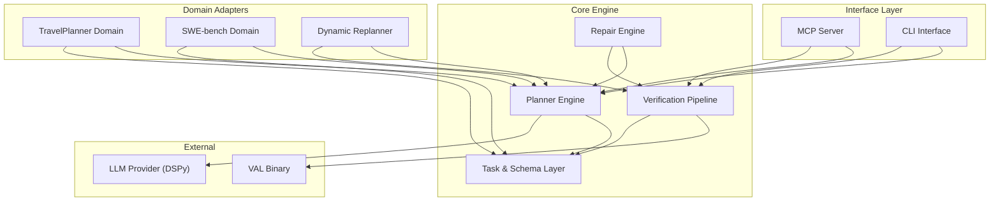

# C4 Component Index — BDI-LLM Formal Verification (PNSV)

## System Components

| Component | Description | Location |
|-----------|-------------|----------|
| [Planner Engine](#planner-engine) | BDI plan generation with DSPy Signatures | `src/bdi_llm/planner/` |
| [Verification Pipeline](#verification-pipeline) | 3-layer structural + symbolic + physics verification | `src/bdi_llm/verifier.py`, `symbolic_verifier.py` |
| [Repair Engine](#repair-engine) | Auto-repair using verifier error feedback | `src/bdi_llm/plan_repair.py` |
| [Task & Schema Layer](#task-schema-layer) | Core data models and configuration | `src/bdi_llm/schemas.py`, `planning_task.py`, `config.py` |
| [TravelPlanner Domain](#travelplanner-domain) | Full TravelPlanner benchmark integration | `src/bdi_llm/travelplanner/` |
| [Dynamic Replanner](#dynamic-replanner) | Classical BDI replan-on-failure loop | `src/bdi_llm/dynamic_replanner/` |
| [SWE-bench Domain](#swe-bench-domain) | SWE-bench code repair integration | `src/bdi_llm/swe_bench/` |
| [Interface Layer](#interface-layer) | MCP server and CLI entry points | `src/interfaces/` |

---

## Component Relationships

---

## Component Details

### Planner Engine

**Location**: `src/bdi_llm/planner/`
**Purpose**: Core BDI plan generation — converts natural language goals into verified IntentionDAGs.

| File | Responsibility |
|------|---------------|
| `bdi_engine.py` | Main BDI loop: goal decomposition → action generation → DAG construction |
| `domain_spec.py` | Pluggable domain configuration (action types, PDDL context, few-shot demos) |
| `signatures.py` | All DSPy Signatures for plan generation |
| `dspy_config.py` | DSPy LM configuration |
| `lm_adapter.py` | LLM provider abstraction |
| `prompts.py` | Prompt templates |

**Interfaces**: `BDIPlanner.generate(task: PlanningTask) -> BDIPlan`

---

### Verification Pipeline

**Location**: `src/bdi_llm/verifier.py`, `src/bdi_llm/symbolic_verifier.py`, `src/bdi_llm/val_runner.py`
**Purpose**: 3-layer composable verification of generated plans.

| Layer | File | Checks |
|-------|------|--------|
| Layer 1: Structural | `verifier.py` | DAG compliance, cycles, empty graphs, connectivity |
| Layer 2: Symbolic | `symbolic_verifier.py` | PDDL precondition/effect validation via VAL |
| Layer 3: Domain Physics | Domain-specific | Blocksworld stacking, TravelPlanner constraints, etc. |

**Interfaces**: `PlanVerifier.verify(plan) -> VerificationResult`, `PDDLSymbolicVerifier.verify(plan, domain, problem) -> VerificationResult`

---

### Repair Engine

**Location**: `src/bdi_llm/plan_repair.py`, `src/bdi_llm/repair_cache.py`
**Purpose**: Intercepts verification failures and iteratively repairs plans using structured error feedback.

**Interfaces**: `PlanRepairEngine.repair(plan, errors, max_iterations=3) -> BDIPlan`

---

### Task & Schema Layer

**Location**: `src/bdi_llm/schemas.py`, `src/bdi_llm/planning_task.py`, `src/bdi_llm/config.py`
**Purpose**: Core Pydantic data models and framework configuration.

**Key Models**: `BDIPlan`, `ActionNode`, `VerificationResult`, `PlanningTask`

---

### TravelPlanner Domain

**Location**: `src/bdi_llm/travelplanner/`
**Purpose**: Full integration with the OSU NLP TravelPlanner benchmark.

| File | Responsibility |
|------|---------------|
| `engine.py` | BDI itinerary generation engine |
| `runner.py` | Evaluation runner with repair integration |
| `review.py` | Stage 3 reviewer + patch-scope repair |
| `official.py` | Official evaluator integration |
| `schemas.py` | Pydantic models for itinerary representation |

---

### Dynamic Replanner

**Location**: `src/bdi_llm/dynamic_replanner/`
**Purpose**: Classical BDI replan-on-failure loop for runtime execution monitoring.

---

### SWE-bench Domain

**Location**: `src/bdi_llm/swe_bench/`
**Purpose**: SWE-bench code repair integration — generates patches for software engineering tasks.

---

### Interface Layer

**Location**: `src/interfaces/`
**Purpose**: External access points for the PNSV framework.

| File | Interface |
|------|-----------|
| `mcp_server.py` | MCP server (stdio transport) |
| `cli.py` | CLI demo entry point |
