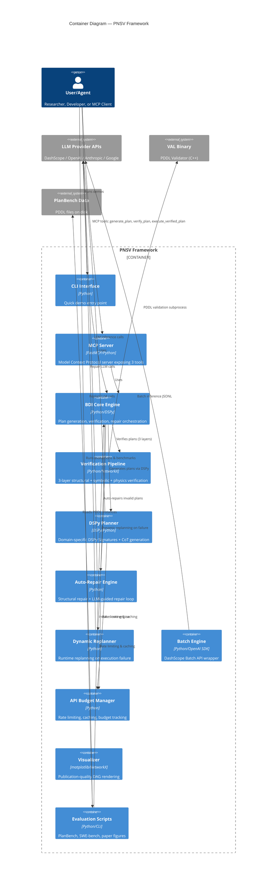

# C4 Container — BDI-LLM Formal Verification (PNSV)

> Generated by c4-architecture skill · Last updated: 2026-03-06

## Container Diagram

## Container Descriptions

### CLI Interface (`src/interfaces/cli.py`)
- **Technology**: Python
- **Responsibilities**: Quick demonstration of end-to-end plan generation → verification → topological sort
- **Size**: 64 lines, 1.9K

### MCP Server (`src/interfaces/mcp_server.py`)
- **Technology**: FastMCP (Python)
- **Responsibilities**: Exposes 3 MCP tools for agent integration
  - `generate_plan(beliefs, desire)` → BDIPlan
  - `verify_plan(plan, domain_file, problem_file)` → Verification result
  - `execute_verified_plan(plan)` → Execution gated by verification ("Trojan Horse" pattern)
- **Size**: 189 lines, 6.0K

### BDI Core Engine (`src/bdi_llm/planner/bdi_engine.py`)
- **Technology**: Python, DSPy
- **Responsibilities**: Central orchestrator for the BDI plan-verify-repair loop
  - Domain selection (Blocksworld, Logistics, Depots, Generic)
  - Few-shot demo loading from YAML
  - Plan generation via `forward()`
  - Iterative repair via `repair_from_val_errors()` (up to 3 iterations)
  - Reasoning trace capture for R1 distillation
- **Size**: 718 lines, 27.6K

### Verification Pipeline (`src/bdi_llm/verifier.py` + `src/bdi_llm/symbolic_verifier.py` + `src/bdi_llm/val_runner.py`)
- **Technology**: Python, NetworkX, VAL subprocess
- **Responsibilities**: 3-layer verification architecture
  - **Layer 1**: Structural (empty graph, cycles, disconnected components)
  - **Layer 2**: Symbolic (PDDL precondition/effect via VAL binary)
  - **Layer 3**: Physics (domain-specific state simulation)
- **Total Size**: 937 lines, 32.4K

### DSPy Planner (`src/bdi_llm/planner/`)
- **Technology**: DSPy, Python
- **Responsibilities**: Domain-specific DSPy Signatures for LLM prompting
  - 5 Signatures: GeneratePlan, GeneratePlanLogistics, GeneratePlanDepots, GeneratePlanGeneric, RepairPlan
  - LogiCoT + CoS prompting protocols
  - Custom LM adapter for DashScope
  - NaivePlanner for unverified baselines
- **Total Size**: ~1,500 lines across 7 files

### Auto-Repair Engine (`src/bdi_llm/plan_repair.py` + `src/bdi_llm/repair_cache.py`)
- **Technology**: Python, NetworkX
- **Responsibilities**: 
  - Structural repair: connect subgraphs, break cycles, unify roots/terminals
  - Plan canonicalization: consistent node IDs, topological edge order
  - RepairCache: LRU cache keyed by (domain, error_signature, plan_hash)
- **Size**: 567 lines, 18.3K

### Dynamic Replanner (`src/bdi_llm/dynamic_replanner/`)
- **Technology**: Python, OpenAI SDK
- **Responsibilities**: Runtime replanning when execution fails mid-plan
  - BeliefBase tracks PDDL world state
  - Executor simulates plan execution
  - DynamicReplanner generates recovery plans
  - SymbolicFallback for graceful degradation
- **Total Size**: ~560 lines across 5 files, 27K

### Batch Engine (`src/bdi_llm/batch_engine.py`)
- **Technology**: Python, OpenAI SDK
- **Responsibilities**: DashScope Batch API wrapper for large-scale evaluation
  - JSONL request building
  - Batch job submission and polling
  - Result download and parsing
- **Size**: 256 lines, 8.3K

### API Budget Manager (`src/bdi_llm/api_budget.py`)
- **Technology**: Python (threading, collections)
- **Responsibilities**: Production-grade API management
  - Rate limiting (RPM/RPH)
  - Exponential backoff with configurable parameters
  - Response caching (LRU)
  - Per-instance budget caps
  - Error pattern tracking for early exit
- **Size**: 395 lines, 13.2K

### Evaluation Scripts (`scripts/`)
- **Technology**: Python CLI scripts
- **Responsibilities**: Benchmark execution and paper figure generation
  - PlanBench: 3 domains × 4 modes evaluation
  - SWE-bench harness
  - Verification-only baselines
  - Dynamic replanning evaluation
  - Paper figure generation
- **Total Size**: ~200K across 15+ scripts

## API Summary

### MCP Server API

| Tool | Input | Output |
|------|-------|--------|
| `generate_plan` | `beliefs: str, desire: str` | `BDIPlan` JSON |
| `verify_plan` | `plan: BDIPlan, domain_file: str, problem_file: str` | Verification result dict |
| `execute_verified_plan` | `plan: BDIPlan` | Execution result (gated by verification) |

### Internal Python API

| Class | Key Methods |
|-------|-------------|
| `BDIPlanner` | `forward()`, `generate_plan()`, `repair_from_val_errors()` |
| `PlanVerifier` | `verify()`, `topological_sort()` |
| `IntegratedVerifier` | `verify_full()`, `build_planner_feedback()` |
| `PlanRepairer` | `repair()` |
| `PlanCanonicalizer` | `canonicalize()` |
| `BatchEngine` | `submit()`, `wait_and_download()` |
| `DynamicReplanner` | `generate_recovery_plan()` |
| `APIBudgetManager` | `check_rate_limit()`, `check_budget()`, `get_stats()` |
