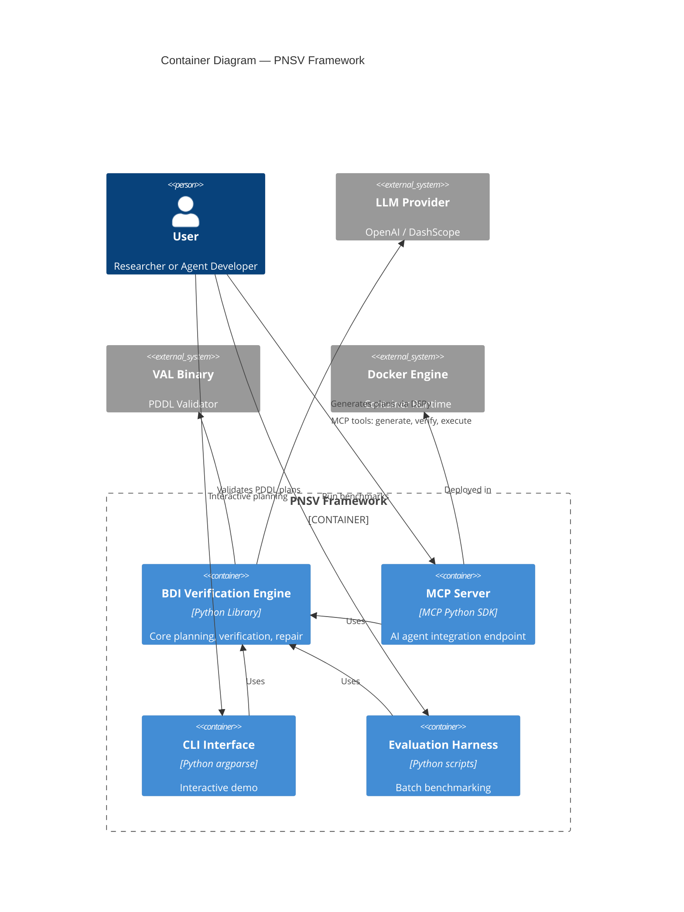

# C4 Container — BDI-LLM Formal Verification (PNSV)

## Containers Overview

PNSV deploys as a single Python application that can run either as a CLI tool, an MCP server, or a batch evaluation harness. All containers share the same codebase and are differentiated by entry point.

---

## Containers

### 1. BDI Verification Engine (Core Library)

| Property | Value |
|----------|-------|
| **Name** | BDI Verification Engine |
| **Type** | Python Library |
| **Technology** | Python 3.10+, DSPy, Pydantic V2, NetworkX, Z3 |
| **Deployment** | pip install / Docker |

**Purpose**: Core planning, verification, and repair logic. Provides the `BDIPlanner`, `PlanVerifier`, `PDDLSymbolicVerifier`, `IntegratedVerifier`, and `PlanRepairEngine` classes.

**Components**:
- [Planner Engine](c4-component.md#planner-engine) — BDI plan generation
- [Verification Pipeline](c4-component.md#verification-pipeline) — 3-layer verification
- [Repair Engine](c4-component.md#repair-engine) — auto-repair loop
- [Task & Schema Layer](c4-component.md#task-schema-layer) — data models

**Interfaces**:
- Python API: `BDIPlanner.generate()`, `PlanVerifier.verify()`, `PlanRepairEngine.repair()`
- No network interfaces (library-only)

---

### 2. MCP Server

| Property | Value |
|----------|-------|
| **Name** | MCP Server |
| **Type** | stdio-based server |
| **Technology** | MCP Python SDK, Docker |
| **Entry Point** | `src/interfaces/mcp_server.py` |
| **Deployment** | `docker run -i --rm bdi-verifier` |

**Purpose**: Exposes the BDI verification loop as a Model Context Protocol endpoint for AI agent integration.

**MCP Tools**:
| Tool | Description |
|------|-------------|
| `generate_plan` | Generate a BDI plan from natural language goal |
| `verify_plan` | Verify a plan against PDDL domain constraints |
| `execute_verified_plan` | Execute a plan only after successful verification |

**Dependencies**: BDI Verification Engine, OpenAI/DashScope API, VAL binary

---

### 3. CLI Interface

| Property | Value |
|----------|-------|
| **Name** | CLI Demo |
| **Type** | Command-line application |
| **Technology** | Python argparse |
| **Entry Point** | `src/interfaces/cli.py` |

**Purpose**: Local demo entry point for interactive plan generation and verification.

---

### 4. Batch Evaluation Harness

| Property | Value |
|----------|-------|
| **Name** | Evaluation Harness |
| **Type** | Batch processing scripts |
| **Technology** | Python, ThreadPoolExecutor, asyncio |
| **Entry Points** | `scripts/evaluation/*.py` |

**Purpose**: Runs large-scale benchmark evaluations (PlanBench, TravelPlanner, SWE-bench) with parallel workers, checkpointing, and API budget management.

**Key Scripts**:
- `run_generic_pddl_eval.py` — Generic PDDL domain evaluation
- `run_travelplanner_eval.py` — TravelPlanner evaluation
- `run_travelplanner_release_matrix.py` — Full release matrix orchestration

---

## Container Diagram

---

## Infrastructure

| Container | Dockerfile | Deployment |
|-----------|-----------|------------|
| MCP Server | [`Dockerfile`](file:///Users/alexjiang/Desktop/BDI_LLM_Formal_Ver/Dockerfile) | `docker build -t bdi-verifier . && docker run -i --rm bdi-verifier` |
| Evaluation Harness | N/A (runs directly) | `python scripts/evaluation/run_*.py` on OCI servers |
