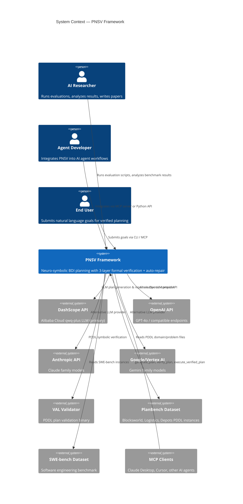

# C4 Context — BDI-LLM Formal Verification (PNSV)

> Generated by c4-architecture skill · Last updated: 2026-03-06

## System Context Diagram

## Personas

### AI Researcher
- **Role**: Runs PlanBench evaluations across domains and ablation modes
- **Touchpoints**: `run_planbench_full.py`, `run_verification_only.py`, `run_dynamic_replanning.py`
- **Goals**: Measure correctness improvement from BASELINE to BDI_REPAIR

### Agent Developer
- **Role**: Integrates formal verification as a planning gatekeeper in AI agent pipelines
- **Touchpoints**: MCP server (`generate_plan`, `verify_plan`, `execute_verified_plan`), Python API
- **Goals**: Ensure only formally verified plans are executed

### End User
- **Role**: Submits natural language goals and receives verified action plans
- **Touchpoints**: CLI, MCP interface
- **Goals**: Get provably correct plans without understanding PDDL

## User Journeys

### Journey 1: Benchmark Evaluation
1. Researcher configures `.env` with `DASHSCOPE_API_KEY`
2. Runs `run_planbench_full.py --domain blocksworld --execution_mode BDI_REPAIR`
3. Framework generates plans via DSPy → Verifies 3 layers → Auto-repairs failures
4. Results written to CSV with per-instance metrics
5. Paper figures generated via `scripts/paper/gen_fig*.py`

### Journey 2: MCP Agent Integration
1. Developer adds PNSV to MCP config (Docker or local)
2. AI agent calls `generate_plan(beliefs, desire)`
3. PNSV returns a `BDIPlan` DAG
4. Agent calls `verify_plan(plan)` → 3-layer check
5. Only on verification pass: `execute_verified_plan(plan)` proceeds

### Journey 3: Dynamic Replanning
1. Plan is generated and verified
2. Executor simulates plan step-by-step
3. Action fails mid-execution
4. BeliefBase updates current world state
5. DynamicReplanner generates recovery plan from remaining goals
6. New plan is verified and execution resumes

## External System Dependencies

| System | Protocol | Purpose | Required |
|--------|----------|---------|----------|
| DashScope API | HTTPS (OpenAI-compat) | Primary LLM provider (qwq-plus) | Yes (at least 1 provider) |
| OpenAI API | HTTPS | Alternative LLM provider | No |
| Anthropic API | HTTPS | Alternative LLM provider | No |
| Google/Vertex AI | HTTPS / gRPC | Alternative LLM provider | No |
| VAL Binary | Local subprocess | PDDL plan validation | Yes (auto-detected) |
| PlanBench Dataset | Local filesystem | PDDL domain/problem files | For evaluation |
| SWE-bench Dataset | Local filesystem | SWE instances | For SWE evaluation |
