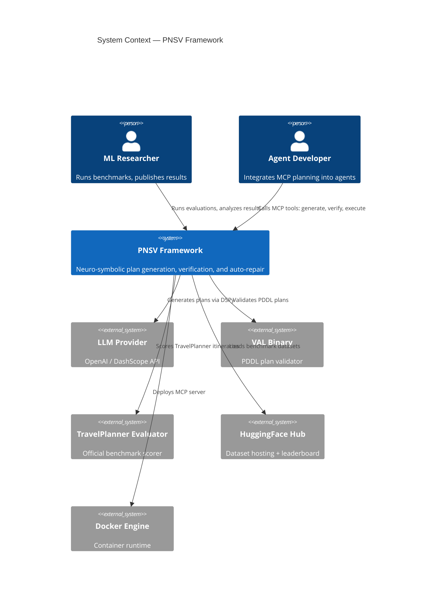

# C4 Context — BDI-LLM Formal Verification (PNSV)

## System Overview

**Short Description**: A neuro-symbolic planning framework that combines Large Language Models with formal verification to produce provably correct action plans.

**Long Description**: PNSV (Pluggable Neuro-Symbolic Verification) implements a complete BDI (Belief-Desire-Intention) plan-verify-repair closed loop. Given a natural-language goal and optional PDDL domain specification, the framework generates structured intention DAGs via DSPy Chain-of-Thought prompting, verifies them through three composable layers (structural, symbolic, domain physics), and auto-repairs failed plans using verifier error feedback. The system exposes its verification loop as a Model Context Protocol (MCP) server, enabling Claude Code, Cursor, and other AI agents to integrate formal planning guarantees into their workflows.

---

## Personas

### Human Users

| Persona | Description | Goals | Key Features |
|---------|-------------|-------|--------------|
| **ML Researcher** | AI/ML researcher studying plan generation and verification | Benchmark PNSV against baselines, publish results | PlanBench evaluation, TravelPlanner evaluation, ablation modes |
| **AI Agent Developer** | Developer building AI agents (Claude Code, Cursor) | Integrate formal verification into agent planning | MCP server, `generate_plan`, `verify_plan`, `execute_verified_plan` |
| **Framework Contributor** | Developer extending PNSV with new domains | Add new domain specs, verification layers | DomainSpec API, pluggable verifier architecture |

### Programmatic Users

| System | Type | Description | Integration |
|--------|------|-------------|-------------|
| **Claude Code / Cursor** | AI Agent | Consumes MCP server for verified planning | MCP protocol (stdio) |
| **Batch Evaluation Pipeline** | Internal System | Runs large-scale benchmark evaluations | Python scripts + API budget management |
| **CI/CD Pipeline** | GitHub Actions | Runs unit/integration tests on push | `pytest` test suite |

---

## System Features

| Feature | Description | Users |
|---------|-------------|-------|
| BDI Plan Generation | Generate structured IntentionDAGs from natural language via DSPy | Researcher, Agent Developer |
| 3-Layer Verification | Structural + Symbolic (VAL) + Domain Physics verification | All |
| Auto-Repair Engine | Iterative error-feedback repair of invalid plans | Researcher, Agent Developer |
| MCP Server | Expose planning loop as Model Context Protocol endpoint | Agent Developer |
| Multi-Domain Evaluation | PlanBench (5 PDDL domains) + TravelPlanner benchmarks | Researcher |
| R1 Distillation Output | Log successful verification trajectories for fine-tuning | Researcher |

---

## User Journeys

### BDI Plan Generation — ML Researcher Journey

1. **Configure domain**: Select PDDL domain (blocksworld/logistics/depots) via `DomainSpec`
2. **Set evaluation parameters**: Choose execution mode (baseline/bdi/bdi-repair), worker count
3. **Run evaluation**: Execute `run_generic_pddl_eval.py` or `run_travelplanner_eval.py`
4. **Monitor progress**: Observe batch progress via API budget manager + checkpoint files
5. **Analyze results**: Parse verification results, compute pass rates, compare ablation modes
6. **Report**: Generate LaTeX tables for paper submission

### MCP Integration — AI Agent Developer Journey

1. **Deploy MCP server**: `docker run -i --rm -e OPENAI_API_KEY=$KEY bdi-verifier`
2. **Configure client**: Add MCP server entry in `claude_desktop_config.json`
3. **Generate plan**: Agent calls `generate_plan` with natural language goal
4. **Verify plan**: Agent calls `verify_plan` with generated plan + PDDL domain
5. **Execute**: On verification pass, agent calls `execute_verified_plan`
6. **Handle failure**: On verification fail, agent receives structured error feedback for retry

---

## External Systems & Dependencies

| System | Type | Description | Integration | Purpose |
|--------|------|-------------|-------------|---------|
| OpenAI / DashScope API | LLM Provider | GPT-5, qwq-plus inference | REST API via DSPy | Plan generation and repair |
| VAL Binary | PDDL Validator | Classical planning validator (C++) | Subprocess call | Layer 2 symbolic verification |
| TravelPlanner Official Evaluator | Benchmark | OSU NLP travel itinerary evaluator | Python import | TravelPlanner scoring |
| HuggingFace Hub | Data Platform | TravelPlanner dataset + leaderboard | `datasets` library | Benchmark data loading |
| Docker Engine | Container Runtime | Builds and runs MCP server container | Docker CLI | Production deployment |

---

## System Context Diagram

---

## Related Documentation

- [Container Documentation](c4-container.md)
- [Component Documentation](c4-component.md)
- [Component Details](c4-components-detail.md)
- [Wiki Catalogue](../wiki-catalogue.md)
- [Technical Reference](../TECHNICAL_REFERENCE.md)
- [Functional Flow](../FUNCTIONAL_FLOW.md)
