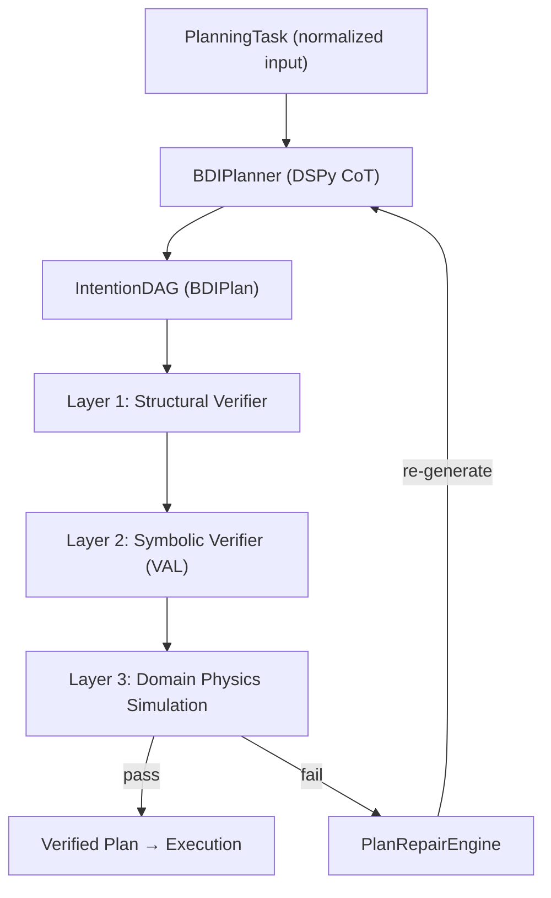

# Wiki Catalogue — BDI-LLM Formal Verification (PNSV)

> Auto-generated documentation structure for the PNSV framework repository.
> Project type: Python ML/Formal-Verification framework
> Primary Language: Python 3.10+ | Comparison Language: JavaScript
> Core Stack: DSPy · Pydantic V2 · PDDL/VAL · Z3 · MCP SDK · NetworkX

---

## 1. Onboarding

### 1.1 Principal-Level Guide

**The ONE Architectural Insight**: PNSV is a *plan-verify-repair closed loop* that wraps LLM generation in a BDI (Belief-Desire-Intention) scaffold. Every plan is a DAG whose nodes carry PDDL-compatible action semantics. The framework intercepts verification failures and feeds structured error traces back into the LLM for auto-repair — a classical BDI replan cycle made neuro-symbolic.

**Design Tradeoffs**:
- DSPy Signatures over raw prompts → reproducible, optimizable, version-controlled
- VAL binary over Z3 for PDDL → classical planning community compatibility
- MCP server as interface → agent-agnostic integration (Claude, Cursor, etc.)

**Where to Go Deep** (reading order):
1. [bdi_engine.py](file:///Users/alexjiang/Desktop/BDI_LLM_Formal_Ver/src/bdi_llm/planner/bdi_engine.py) — core BDI loop (26KB)
2. [symbolic_verifier.py](file:///Users/alexjiang/Desktop/BDI_LLM_Formal_Ver/src/bdi_llm/symbolic_verifier.py) — PDDL/VAL integration (19KB)
3. [plan_repair.py](file:///Users/alexjiang/Desktop/BDI_LLM_Formal_Ver/src/bdi_llm/plan_repair.py) — auto-repair engine (15KB)
4. [domain_spec.py](file:///Users/alexjiang/Desktop/BDI_LLM_Formal_Ver/src/bdi_llm/planner/domain_spec.py) — domain-specific configuration (21KB)
5. [signatures.py](file:///Users/alexjiang/Desktop/BDI_LLM_Formal_Ver/src/bdi_llm/planner/signatures.py) — all DSPy Signatures (40KB)

### 1.2 Zero-to-Hero Learning Path

**Part I: Foundations**

| Concept | Python (this project) | JavaScript Equivalent |
|---------|----------------------|----------------------|
| Type validation | Pydantic `BaseModel` | Zod schemas |
| Prompt engineering | DSPy `Signature` + `Module` | LangChain `PromptTemplate` |
| DAG representation | NetworkX `DiGraph` | `graphlib` / `dagre` |
| Formal verification | Z3 Solver, VAL binary | N/A (no JS equivalent) |
| Agent protocol | MCP Python SDK | MCP TypeScript SDK |

**Part II: Architecture & Domain Model**
- BDI cognitive architecture: `Beliefs` (world state) → `Desires` (goals) → `Intentions` (committed plans)
- Plan representation: `IntentionDAG` with `ActionNode` carrying PDDL preconditions/effects
- Verification pipeline: structural → symbolic → physics (3 composable layers)
- Domain spec: pluggable configuration per domain (blocksworld, logistics, depots, SWE-bench, TravelPlanner)

**Part III: Dev Setup & Contributing**
- Clone + `pip install -e ".[dev]"` + `.env` setup
- Run tests: `pytest tests/`
- Run evaluation: `python scripts/evaluation/run_generic_pddl_eval.py`
- MCP server: `python src/interfaces/mcp_server.py`

**Appendix: Glossary**

| Term | Definition |
|------|-----------|
| BDI | Belief-Desire-Intention cognitive architecture |
| PNSV | Pluggable Neuro-Symbolic Verification |
| IntentionDAG | Directed Acyclic Graph representing a committed plan |
| VAL | Classical PDDL plan validator binary |
| DSPy | Stanford NLP framework for systematic LM programming |
| PDDL | Planning Domain Definition Language |
| MCP | Model Context Protocol (Anthropic standard) |
| CoT | Chain-of-Thought prompting pattern |
| PlanBench | PDDL benchmark suite (blocksworld, logistics, depots) |
| TravelPlanner | OSU NLP multi-constraint travel itinerary benchmark |

---

## 2. Getting Started

### 2.1 Overview
- [README.md](file:///Users/alexjiang/Desktop/BDI_LLM_Formal_Ver/README.md) — project overview, tech stack, benchmarks
- [README_CN.md](file:///Users/alexjiang/Desktop/BDI_LLM_Formal_Ver/README_CN.md) — 中文版

### 2.2 Installation & Setup
- [pyproject.toml](file:///Users/alexjiang/Desktop/BDI_LLM_Formal_Ver/pyproject.toml) — package definition
- [.env.example](file:///Users/alexjiang/Desktop/BDI_LLM_Formal_Ver/.env.example) — environment variable template
- [Dockerfile](file:///Users/alexjiang/Desktop/BDI_LLM_Formal_Ver/Dockerfile) — containerized deployment

### 2.3 Quick Reference
- [PLAN.md](file:///Users/alexjiang/Desktop/BDI_LLM_Formal_Ver/PLAN.md) — development plans
- [RESULTS_PROVENANCE.md](file:///Users/alexjiang/Desktop/BDI_LLM_Formal_Ver/RESULTS_PROVENANCE.md) — benchmark result provenance
- [docs/FUNCTIONAL_FLOW.md](file:///Users/alexjiang/Desktop/BDI_LLM_Formal_Ver/docs/FUNCTIONAL_FLOW.md) — end-to-end runtime flow

---

## 3. Deep Dive

### 3.1 Core Planning Engine (`src/bdi_llm/planner/`)

| File | Purpose | Lines |
|------|---------|-------|
| [bdi_engine.py](file:///Users/alexjiang/Desktop/BDI_LLM_Formal_Ver/src/bdi_llm/planner/bdi_engine.py) | BDI plan generation loop, DAG construction, repair integration | ~800 |
| [domain_spec.py](file:///Users/alexjiang/Desktop/BDI_LLM_Formal_Ver/src/bdi_llm/planner/domain_spec.py) | Pluggable domain configs — action types, PDDL context, few-shot demos | ~650 |
| [signatures.py](file:///Users/alexjiang/Desktop/BDI_LLM_Formal_Ver/src/bdi_llm/planner/signatures.py) | All DSPy Signatures for plan generation and decomposition | ~1200 |
| [dspy_config.py](file:///Users/alexjiang/Desktop/BDI_LLM_Formal_Ver/src/bdi_llm/planner/dspy_config.py) | DSPy LM configuration and model selection | ~140 |
| [lm_adapter.py](file:///Users/alexjiang/Desktop/BDI_LLM_Formal_Ver/src/bdi_llm/planner/lm_adapter.py) | LLM provider abstraction layer | ~320 |
| [prompts.py](file:///Users/alexjiang/Desktop/BDI_LLM_Formal_Ver/src/bdi_llm/planner/prompts.py) | Prompt templates and helpers | ~130 |

### 3.2 Verification Pipeline (`src/bdi_llm/`)

| File | Purpose |
|------|---------|
| [verifier.py](file:///Users/alexjiang/Desktop/BDI_LLM_Formal_Ver/src/bdi_llm/verifier.py) | Layer 1 structural verifier — DAG invariants, cycles, connectivity |
| [symbolic_verifier.py](file:///Users/alexjiang/Desktop/BDI_LLM_Formal_Ver/src/bdi_llm/symbolic_verifier.py) | Layer 2 PDDL symbolic verifier — VAL binary integration |
| [val_runner.py](file:///Users/alexjiang/Desktop/BDI_LLM_Formal_Ver/src/bdi_llm/val_runner.py) | VAL subprocess management and output parsing |
| [plan_repair.py](file:///Users/alexjiang/Desktop/BDI_LLM_Formal_Ver/src/bdi_llm/plan_repair.py) | Auto-repair engine — error feedback → re-generation loop |
| [repair_cache.py](file:///Users/alexjiang/Desktop/BDI_LLM_Formal_Ver/src/bdi_llm/repair_cache.py) | Repair outcome caching for deduplication |

### 3.3 Task & Schema Layer (`src/bdi_llm/`)

| File | Purpose |
|------|---------|
| [planning_task.py](file:///Users/alexjiang/Desktop/BDI_LLM_Formal_Ver/src/bdi_llm/planning_task.py) | `PlanningTask` — normalized task representation |
| [schemas.py](file:///Users/alexjiang/Desktop/BDI_LLM_Formal_Ver/src/bdi_llm/schemas.py) | Core Pydantic models — `BDIPlan`, `ActionNode`, `VerificationResult` |
| [config.py](file:///Users/alexjiang/Desktop/BDI_LLM_Formal_Ver/src/bdi_llm/config.py) | Framework-wide configuration |
| [batch_engine.py](file:///Users/alexjiang/Desktop/BDI_LLM_Formal_Ver/src/bdi_llm/batch_engine.py) | Batch inference engine for parallel evaluation |
| [visualizer.py](file:///Users/alexjiang/Desktop/BDI_LLM_Formal_Ver/src/bdi_llm/visualizer.py) | Plan DAG visualization |

### 3.4 TravelPlanner Domain (`src/bdi_llm/travelplanner/`)

| File | Purpose |
|------|---------|
| [engine.py](file:///Users/alexjiang/Desktop/BDI_LLM_Formal_Ver/src/bdi_llm/travelplanner/engine.py) | TravelPlanner BDI generation engine |
| [runner.py](file:///Users/alexjiang/Desktop/BDI_LLM_Formal_Ver/src/bdi_llm/travelplanner/runner.py) | Evaluation runner with repair integration |
| [review.py](file:///Users/alexjiang/Desktop/BDI_LLM_Formal_Ver/src/bdi_llm/travelplanner/review.py) | Stage 3 reviewer + patch-scope repair |
| [official.py](file:///Users/alexjiang/Desktop/BDI_LLM_Formal_Ver/src/bdi_llm/travelplanner/official.py) | Official evaluator integration |
| [adapter.py](file:///Users/alexjiang/Desktop/BDI_LLM_Formal_Ver/src/bdi_llm/travelplanner/adapter.py) | Task adapter for TravelPlanner format |
| [schemas.py](file:///Users/alexjiang/Desktop/BDI_LLM_Formal_Ver/src/bdi_llm/travelplanner/schemas.py) | Pydantic models for itinerary representation |
| [signatures.py](file:///Users/alexjiang/Desktop/BDI_LLM_Formal_Ver/src/bdi_llm/travelplanner/signatures.py) | DSPy Signatures for itinerary generation |
| [reference_info.py](file:///Users/alexjiang/Desktop/BDI_LLM_Formal_Ver/src/bdi_llm/travelplanner/reference_info.py) | Database reference info extraction |

### 3.5 Dynamic Replanning (`src/bdi_llm/dynamic_replanner/`)

| File | Purpose |
|------|---------|
| [replanner.py](file:///Users/alexjiang/Desktop/BDI_LLM_Formal_Ver/src/bdi_llm/dynamic_replanner/replanner.py) | Classical BDI replan-on-failure loop |
| [belief_base.py](file:///Users/alexjiang/Desktop/BDI_LLM_Formal_Ver/src/bdi_llm/dynamic_replanner/belief_base.py) | Belief state management |
| [executor.py](file:///Users/alexjiang/Desktop/BDI_LLM_Formal_Ver/src/bdi_llm/dynamic_replanner/executor.py) | Plan execution with failure detection |

### 3.6 Interfaces (`src/interfaces/`)

| File | Purpose |
|------|---------|
| [mcp_server.py](file:///Users/alexjiang/Desktop/BDI_LLM_Formal_Ver/src/interfaces/mcp_server.py) | MCP server — exposes `generate_plan`, `verify_plan`, `execute_verified_plan` |
| [cli.py](file:///Users/alexjiang/Desktop/BDI_LLM_Formal_Ver/src/interfaces/cli.py) | Local CLI demo entry point |

### 3.7 Evaluation & Scripts (`scripts/`)

| Directory | Purpose |
|-----------|---------|
| [scripts/evaluation/](file:///Users/alexjiang/Desktop/BDI_LLM_Formal_Ver/scripts/evaluation/) | PlanBench + TravelPlanner evaluation scripts (27 files) |
| [scripts/batch/](file:///Users/alexjiang/Desktop/BDI_LLM_Formal_Ver/scripts/batch/) | Batch inference / API budget scripts |
| [scripts/replanning/](file:///Users/alexjiang/Desktop/BDI_LLM_Formal_Ver/scripts/replanning/) | Dynamic replanning pipeline scripts |
| [scripts/swe_bench/](file:///Users/alexjiang/Desktop/BDI_LLM_Formal_Ver/scripts/swe_bench/) | SWE-bench prediction generation & evaluation |
| [scripts/paper/](file:///Users/alexjiang/Desktop/BDI_LLM_Formal_Ver/scripts/paper/) | Paper figure / table generation scripts |

### 3.8 Tests (`tests/`)

| Directory | Purpose |
|-----------|---------|
| [tests/unit/](file:///Users/alexjiang/Desktop/BDI_LLM_Formal_Ver/tests/unit/) | Unit tests — verifier, domain_spec, schemas |
| [tests/integration/](file:///Users/alexjiang/Desktop/BDI_LLM_Formal_Ver/tests/integration/) | API-dependent integration tests |
| [tests/smoke/](file:///Users/alexjiang/Desktop/BDI_LLM_Formal_Ver/tests/smoke/) | Smoke tests |
| [tests/fixtures/](file:///Users/alexjiang/Desktop/BDI_LLM_Formal_Ver/tests/fixtures/) | Test fixtures (PDDL domain/problem files) |

---

## 4. Infrastructure

### 4.1 Configuration
- [configs/](file:///Users/alexjiang/Desktop/BDI_LLM_Formal_Ver/configs/) — code style guides, configuration files
- [.github/](file:///Users/alexjiang/Desktop/BDI_LLM_Formal_Ver/.github/) — GitHub CI/CD workflows

### 4.2 Data & Workspaces
- `workspaces/planbench_data/` — PDDL benchmark assets and local VAL binary
- `workspaces/TravelPlanner_official/` — Official TravelPlanner benchmark checkout

### 4.3 Paper & Research
- [paper_icml2026/](file:///Users/alexjiang/Desktop/BDI_LLM_Formal_Ver/paper_icml2026/) — ICML 2026 paper LaTeX sources (16 files)
- [runs/](file:///Users/alexjiang/Desktop/BDI_LLM_Formal_Ver/runs/) — Evaluation run outputs and checkpoints
